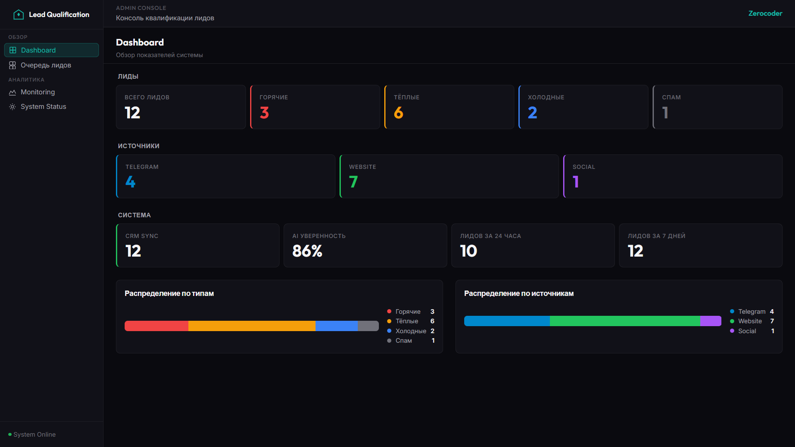
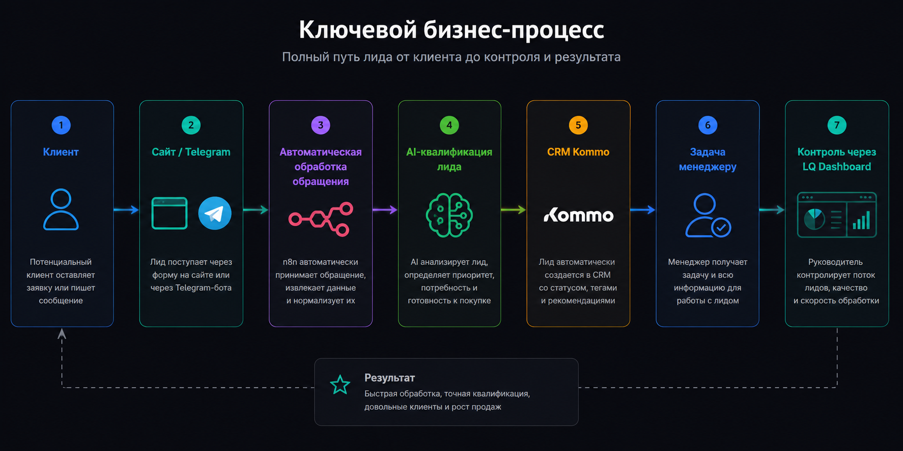
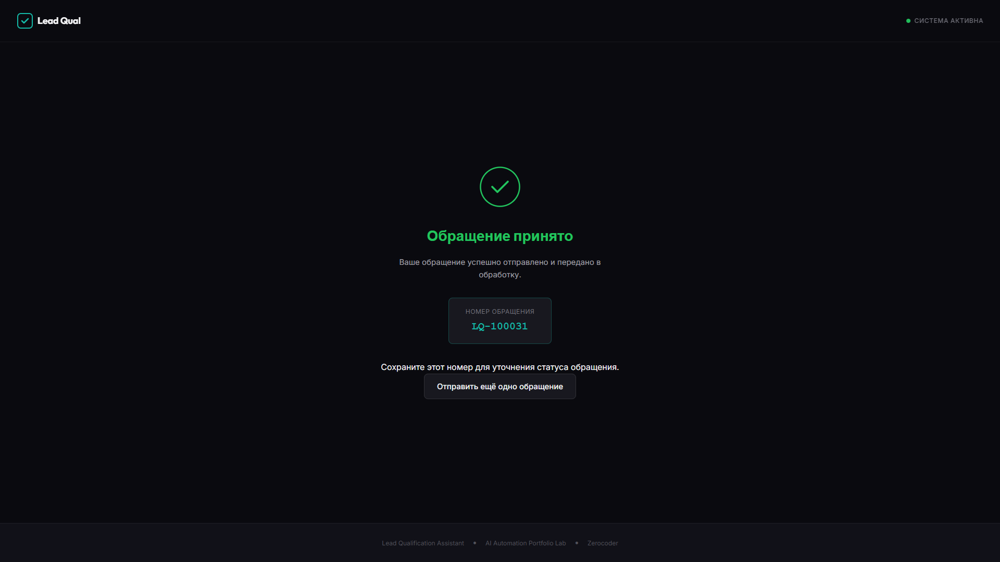
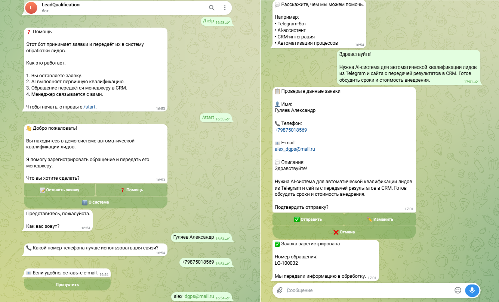
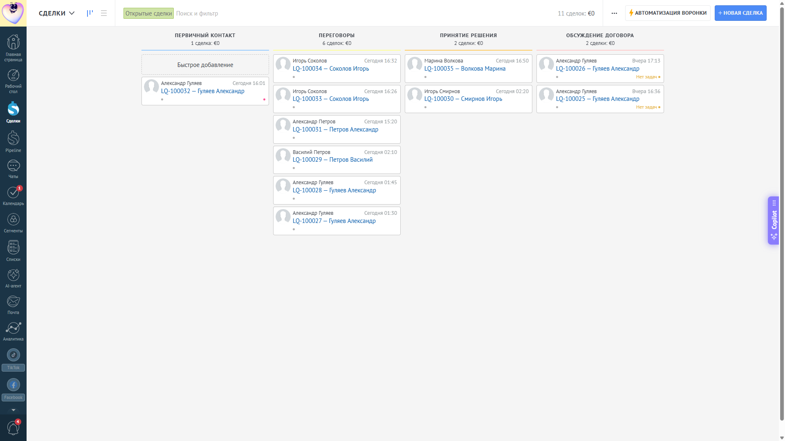
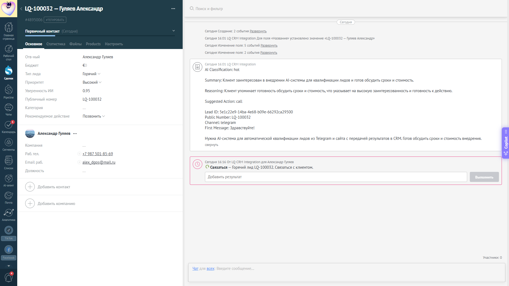
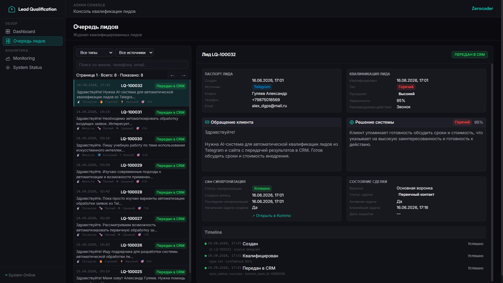
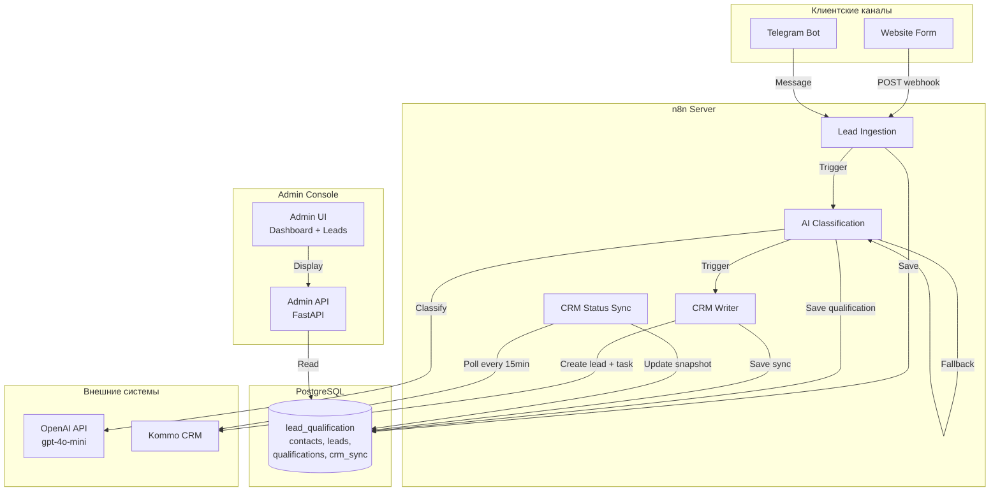

# Lead Qualification MVP

**Мгновенная квалификация входящих лидов. Автоматическая обработка 24/7. Готовый результат в CRM.**

Система автоматически принимает обращения из Website и Telegram, классифицирует с помощью AI, создаёт сделки в Kommo и ставит задачи менеджеру — горячие лиды через 15 минут, тёплые через 24 часа.

**Результат для бизнеса:**

- ⚡ **Мгновенная реакция** — AI-классификация за секунды, не часы
- 🔄 **24/7 режим** — ночные и выходные лиды не теряются
- 📊 **Автоматическая приоритизация** — hot/warm/cold/spam
- ✅ **CRM-интеграция** — сделки и задачи создаются автоматически
- 👁️ **Прозрачность** — единая консоль мониторинга для руководителя

---



---

## Быстрая навигация

### Для заказчика

- [Ценность для бизнеса](docs/BUSINESS_VALUE.md) — что получает бизнес после внедрения
- [Демонстрация системы](docs/SYSTEM_DEMO.md) — путь лида через систему
- [Сквозные сценарии](docs/E2E_SCENARIOS.md) — пошаговые сценарии работы
- [Руководство пользователя](docs/USER_GUIDE.md) — как работать с системой
- [Развёртывание](docs/DEPLOYMENT_GUIDE.md) — как запустить

### Для инженера

- [Архитектура](docs/ARCHITECTURE.md) — как устроена система
- [AI-классификация](docs/AI_QUALIFICATION.md) — логика квалификации
- [План реализации](docs/IMPLEMENTATION_PLAN.md) — этапы разработки
- [Соответствие ТЗ](docs/TZ_COMPLIANCE_REPORT.md) — покрытие требований

---

## Ключевой бизнес-процесс



**Полный путь лида:**

```
Клиент → Заявка → Автоматическая обработка → AI → CRM → Менеджер → Контроль
```

1. **Клиент** оставляет заявку через Website или Telegram
2. **n8n workflow** принимает и сохраняет в PostgreSQL
3. **AI классифицирует:** hot (готов купить), warm (интерес), cold (думает), spam (нецелевой)
4. **Создаётся сделка** в Kommo CRM с правильным статусом воронки
5. **Задача менеджеру** создаётся автоматически (Hot: +15 мин, Warm: +24 ч, Cold: +7 дней)
6. **Admin Console** показывает состояние всех лидов и CRM-синхронизацию

Подробно: [Демонстрация системы](docs/SYSTEM_DEMO.md)

---

## Демонстрация системы

### Шаг 1. Клиент оставляет заявку

**Вариант 1: Website**



Клиент заполняет форму на сайте, получает подтверждение с номером заявки.

**Вариант 2: Telegram**



Клиент пишет боту, получает мгновенную классификацию.

---

### Шаг 2. Автоматическая обработка

Три workflow обрабатывают обращение как единый конвейер:

**Lead Ingestion** — приём из Website/Telegram, валидация, сохранение в БД


**AI Classification** — классификация через OpenAI, fallback при ошибке


**Kommo Writer** — создание сделки и задачи в CRM


---

### Шаг 3. Передача результата в CRM

**Список сделок в Kommo**



**Горячий лид в CRM**



Сделка автоматически получает:
- Правильный статус воронки (Hot Lead / Warm Lead / Cold Lead)
- Задачу менеджеру с нужным сроком
- Все данные классификации в примечании

---

### Шаг 4. Контроль процесса

**Очередь лидов для менеджера**



**Dashboard для руководителя**


Результат полного цикла:
- **Менеджер** получает приоритизированную очередь с готовыми данными
- **Руководитель** видит метрики в реальном времени
- **Клиент** получает быстрый отклик

---

## Ценность для бизнеса

### Проблемы, которые решает система

| Проблема | Решение |
|----------|---------|
| **Потеря лидов** | Автоматический приём 24/7 |
| **Медленная реакция** | AI-классификация за секунды |
| **Нет приоритизации** | Автоматическая квалификация hot/warm/cold |
| **Неконсистентность** | Единые правила для всех лидов |
| **Нет контроля** | Централизованная консоль мониторинга |

Подробно: [Ценность для бизнеса](docs/BUSINESS_VALUE.md)

---

## Классификация лидов

| Тип | Описание | CRM Status | Задача |
|-----|----------|------------|--------|
| **Hot** | Готов купить немедленно | Hot Lead | +15 минут |
| **Warm** | Заинтересован, нужен follow-up | Warm Lead | +24 часа |
| **Cold** | Не готов к решению сейчас | Cold Lead | +7 дней |
| **Spam** | Нецелевое обращение | Spam | Не создаётся |

Почему AI-классификация с fallback: [AI-классификация](docs/AI_QUALIFICATION.md)

---

## Архитектура



Подробно: [Архитектура](docs/ARCHITECTURE.md)

---

## Технологический стек

| Слой | Технология | Версия |
|------|------------|--------|
| **Workflow Engine** | n8n (self-hosted) | Latest |
| **AI Provider** | OpenAI API | gpt-4o-mini |
| **CRM** | Kommo | API v4 |
| **Database** | PostgreSQL | 14+ |
| **Admin Backend** | FastAPI, Python | 3.12 |
| **Admin Frontend** | Vanilla JS | — |
| **Telegram** | Telegram Bot API | — |
| **Reverse Proxy** | Traefik | — |
| **Deploy** | Docker Compose | — |

---

## Быстрый запуск

### Предварительные требования

- Docker и Docker Compose
- OpenAI API ключ
- Telegram Bot Token (опционально)
- Kommo Access Token

### Запуск

```bash
# 1. Клонировать репозиторий
git clone <repository-url>
cd n8n-lead-qualification

# 2. Настроить переменные окружения
cd infra
cp .env.example .env
# Отредактируйте .env с вашими ключами

# 3. Запустить сервисы
docker compose up -d

# 4. Проверить статус
docker compose ps
```

После запуска:

| Сервис | URL |
|--------|-----|
| **Client UI** | http://localhost:5180 |
| **Admin UI** | http://localhost:8080 |
| **n8n UI** | http://localhost:5678 |
| **Admin API** | http://localhost:8000/docs |

Подробно: [Руководство по развёртыванию](docs/DEPLOYMENT_GUIDE.md)

---

## Структура проекта

```
n8n-lead-qualification/
├── README.md                    # Этот файл
├── docs/                        # Документация
│   ├── BUSINESS_VALUE.md        # Ценность для бизнеса
│   ├── SYSTEM_DEMO.md           # Демонстрация системы
│   ├── ARCHITECTURE.md          # Архитектура системы
│   ├── USER_GUIDE.md            # Руководство пользователя
│   ├── DEPLOYMENT_GUIDE.md      # Руководство по развёртыванию
│   ├── E2E_SCENARIOS.md         # Сквозные сценарии
│   ├── AI_QUALIFICATION.md      # AI-классификация
│   ├── PROJECT_STATE.md         # Текущее состояние
│   ├── PROJECT_HISTORY.md       # История развития
│   ├── IMPLEMENTATION_PLAN.md   # План реализации
│   ├── SCREENSHOTS.md           # Галерея экранов
│   └── TZ_COMPLIANCE_REPORT.md   # Соответствие ТЗ
├── infra/                       # Инфраструктура
│   ├── docker-compose.yml       # Сервисы Docker
│   ├── sql/                      # Схема БД
│   └── docker/                   # Конфигурации Docker
├── admin-ui/                    # Admin Console Frontend
├── admin-backend/               # Admin Console Backend (FastAPI)
├── client-ui/                   # Клиентский UI
├── workflow/                     # n8n workflows
│   └── n8n/workflows/           # JSON экспорт workflows
├── task_history/                # История задач
└── docs/screenshots/            # Скриншоты
```

---

## Документация

### Для заказчика

| Документ | Назначение |
|----------|------------|
| [BUSINESS_VALUE.md](docs/BUSINESS_VALUE.md) | Ценность для бизнеса |
| [SYSTEM_DEMO.md](docs/SYSTEM_DEMO.md) | Демонстрация системы |
| [USER_GUIDE.md](docs/USER_GUIDE.md) | Руководство пользователя |
| [E2E_SCENARIOS.md](docs/E2E_SCENARIOS.md) | Сквозные сценарии |

### Для инженера

| Документ | Назначение |
|----------|------------|
| [ARCHITECTURE.md](docs/ARCHITECTURE.md) | Архитектура системы |
| [AI_QUALIFICATION.md](docs/AI_QUALIFICATION.md) | Логика AI-классификации |
| [IMPLEMENTATION_PLAN.md](docs/IMPLEMENTATION_PLAN.md) | План реализации |
| [DEPLOYMENT_GUIDE.md](docs/DEPLOYMENT_GUIDE.md) | Развёртывание |

---

## Рыночное подтверждение

**Подтверждающие заказы:**

| Заказ | Платформа | Бюджет | Ключевые требования |
|-------|-----------|--------|---------------------|
| FL.ru #5507855 | n8n + Claude API | 60 000 руб. | 5 AI-агентов для маркетплейсов |
| FL.ru #5508101 | n8n + Asterisk | — | Анализ звонков, интеграция с Битрикс24 |
| FL.ru #5506712 | Мессенджер + Kommo | — | Квалификация водителей такси (Перу) |
| FL.ru #5507454 | Zapier + Kommo + OpenAI | — | Два последовательных запроса к OpenAI |

**Покрытие спроса:** 33% заказов упоминают n8n — критический дефицит портфолио закрыт.

---

## Лицензия

MIT License — для демонстрационных целей.

---

## Контакты

- **Public Demo**: https://lead-qual.alex-n8n.site/
- **Admin Demo**: https://lead-qual-admin.alex-n8n.site/
- **Repository**: GitHub (публикация планируется)