# Lead Qualification MVP

**Lead Qualification MVP** — демонстрационная система автоматической квалификации входящих лидов с использованием AI-классификации и интеграцией в CRM. Решает проблему ручной обработки обращений, обеспечивая 24/7 доступность, консистентную квалификацию и мгновенный отклик на входящие лиды.

Проект показывает полный цикл: от обращения клиента через Website или Telegram → AI-классификация → PostgreSQL → Kommo CRM → задача менеджеру → мониторинг через Admin Console.

## Быстрая навигация

### Для знакомства с проектом

- [Отчёт о соответствии ТЗ](docs/TZ_COMPLIANCE_REPORT.md)
- [Руководство пользователя](docs/USER_GUIDE.md)
- [Руководство по развёртыванию](docs/DEPLOYMENT_GUIDE.md)
- [Сквозные сценарии](docs/E2E_SCENARIOS.md)

### Для изучения архитектуры

- [Архитектура](docs/ARCHITECTURE.md)
- [AI-классификация](docs/AI_QUALIFICATION.md)
- [План реализации](docs/IMPLEMENTATION_PLAN.md)

### Для развития проекта

- [Состояние проекта](docs/PROJECT_STATE.md)
- [История проекта](docs/PROJECT_HISTORY.md)
- [Галерея экранов](docs/SCREENSHOTS.md)

---

## Проблема

Малый и средний бизнес, работающий с входящими лидами, сталкивается с типичными проблемами:

| Проблема | Последствия |
|----------|-------------|
| **Ручная обработка** | Менеджеры тратят время на первичный отсев, теряется скорость |
| **Медленный отклик** | Клиенты уходят к конкурентам, ожидая ответа часами |
| **Неконсистентная квалификация** | Разные менеджеры по-разному оценивают одних и тех же лидов |
| **Отсутствие 24/7** | Ночные и выходные лиды остаются без внимания до следующего рабочего дня |
| **Нет стандартов** | Отсутствие единого критерия квалификации и приоритизации |

Lead Qualification автоматизирует первичную квалификацию, обеспечивая:
- **Мгновенный отклик** — лид классифицируется за секунды
- **24/7 доступность** — AI работает круглосуточно
- **Консистентность** — единые правила классификации
- **Интеграция в CRM** — лиды сразу попадают в воронку продаж

---

## Почему AI-классификация с Fallback

**Controlled AI + Rule-based Fallback** — архитектура, в которой:

- **AI (OpenAI GPT-4o-mini)** выполняет первичную классификацию лида по типу (hot/warm/cold/spam), приоритету и рекомендуемому действию
- **Confidence** рассчитывается AI и позволяет системе оценить уверенность
- **Rule-based Fallback** включается при недоступности AI или низкой уверенности — классификация по ключевым словам
- **CRM Integration** — лиды автоматически попадают в Kommo с правильным статусом и приоритетом
- **Manager Tasks** — задачи создаются автоматически с учётом типа лида (Hot: +15 мин, Warm: +24 ч, Cold: +7 дней)

Чем отличается от полностью автоматического LLM: система предсказуема, решение основано на правилах и AI работает в рамках определённой схемы JSON, а не «придумывает» ответ произвольно.

---

## Ключевой бизнес-процесс

```
Website / Telegram
       ↓
   Lead Ingestion
       ↓
  AI Qualification
       ↓
    PostgreSQL
       ↓
    Kommo CRM
       ↓
  Manager Tasks
       ↓
  Sales Pipeline
       ↓
 Status Sync → Admin UI Monitoring
```

**Полный путь лида:**

1. Клиент оставляет заявку через Website или Telegram
2. n8n workflow принимает и сохраняет в PostgreSQL
3. AI классифицирует: hot (готов купить), warm (интерес), cold (думает), spam (нецелевой)
4. Лид создаётся в Kommo CRM с правильным статусом воронки
5. Задача менеджеру создаётся автоматически (Hot: +15 мин, Warm: +24 ч)
6. Admin Console показывает состояние всех лидов и CRM-синхронизацию

---

## Демонстрация системы

Ниже — ключевые экраны системы. Все изображения из [`docs/screenshots/`](docs/screenshots/).

### Landing Page

**Главный экран**

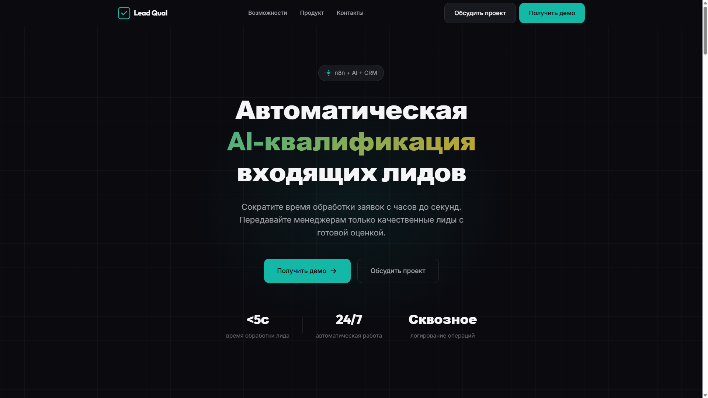

- **Что показано**: главный экран лендинга Lead Qualification
- **Роль в системе**: первое касание с продуктом
- **Почему важно**: демонстрирует ценностное предложение

**Решаемые проблемы**

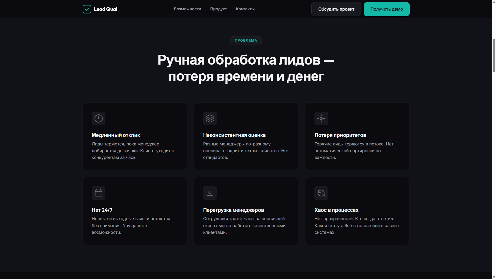

- **Что показано**: блок с описанием проблем клиентов
- **Роль в системе**: объяснение боли целевой аудитории

**Решение**

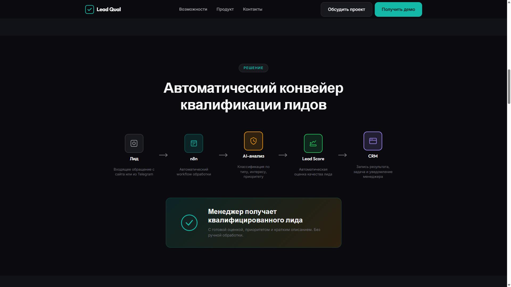

- **Что показано**: как система решает проблемы
- **Роль в системе**: позиционирование продукта

---

### Website — форма заявки

**Пустая форма**

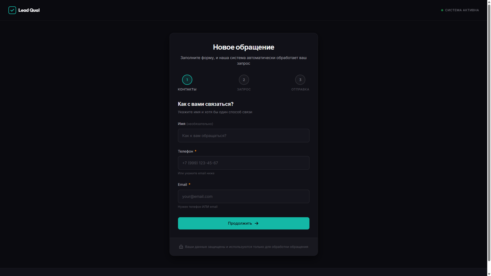

- **Что показано**: форма заявки до заполнения
- **Роль в системе**: вход Website-лидов в систему

**Заполненная форма**

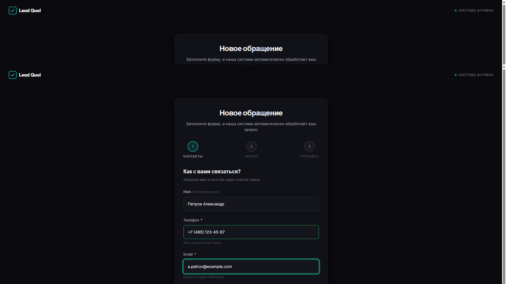

- **Что показано**: форма с данными клиента
- **Роль в системе**: демонстрация ввода данных

**Успешная отправка**


- **Что показано**: подтверждение приёма заявки
- **Роль в системе**: обратная связь клиенту

---

### Telegram Bot

**Обработка горячего лида**


- **Что показано**: диалог с ботом, классификация как hot
- **Роль в системе**: альтернативный канал входа лидов
- **Почему важно**: показывает мультиканальность и мгновенную классификацию

---

### Admin Console — Dashboard

**Обзор системы**


- **Что показано**: сводка по лидам, распределение по типам, CRM-статус
- **Роль в системе**: оперативный мониторинг системы
- **Почему важно**: показывает наблюдаемость в реальном времени

---

### Lead Queue — очередь лидов

**Горячие лиды (Hot)**


- **Что показано**: лиды с классификацией hot
- **Роль в системе**: приоритетная очередь для менеджеров
- **Почему важно**: демонстрирует результат AI-классификации

**Тёплые лиды (Warm)**

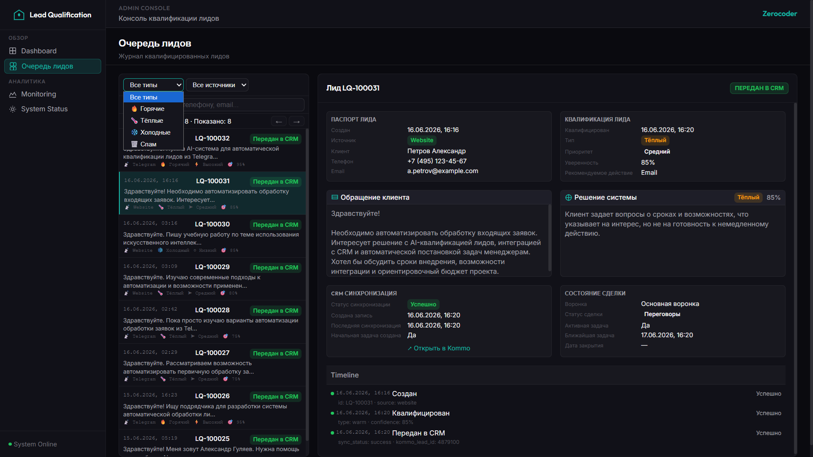

- **Что показано**: лиды с классификацией warm
- **Роль в системе**: отложенный follow-up

**Холодные лиды (Cold)**

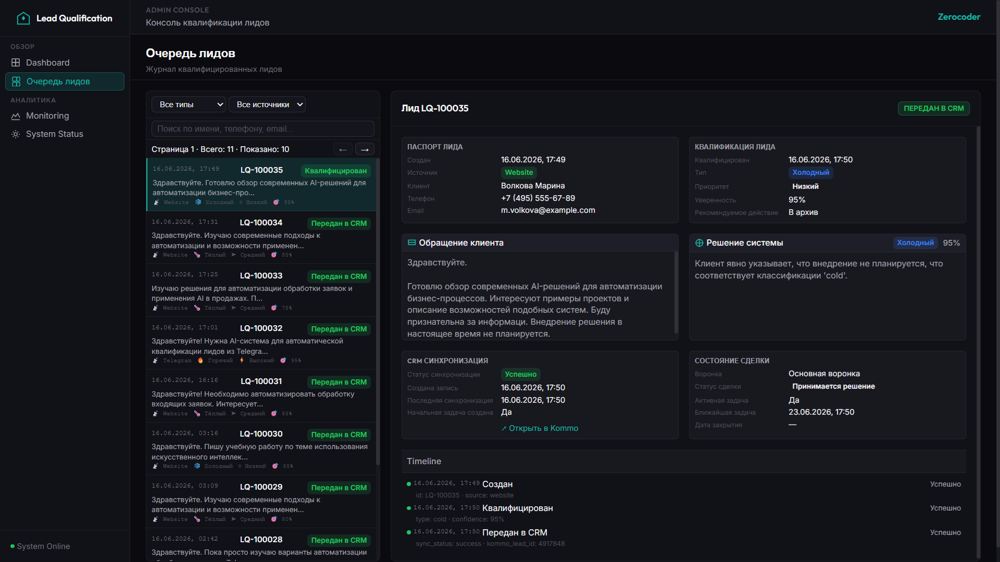

- **Что показано**: лиды с классификацией cold
- **Роль в системе**: низкоприоритетная очередь

**Спам**

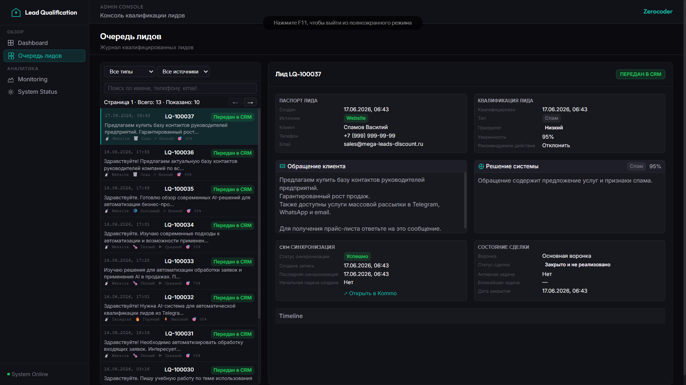

- **Что показано**: отфильтрованный спам
- **Роль в системе**: автоматическая фильтрация нецелевых

---

### Kommo CRM Integration

**Список сделок**


- **Что показано**: сделки в Kommo CRM
- **Роль в системе**: интеграция с CRM
- **Почему важно**: показывает end-to-end поток

**Горячий лид в CRM**


- **Что показано**: карточка горячего лида
- **Роль в системе**: правильный статус воронки

**Тёплый лид в CRM**

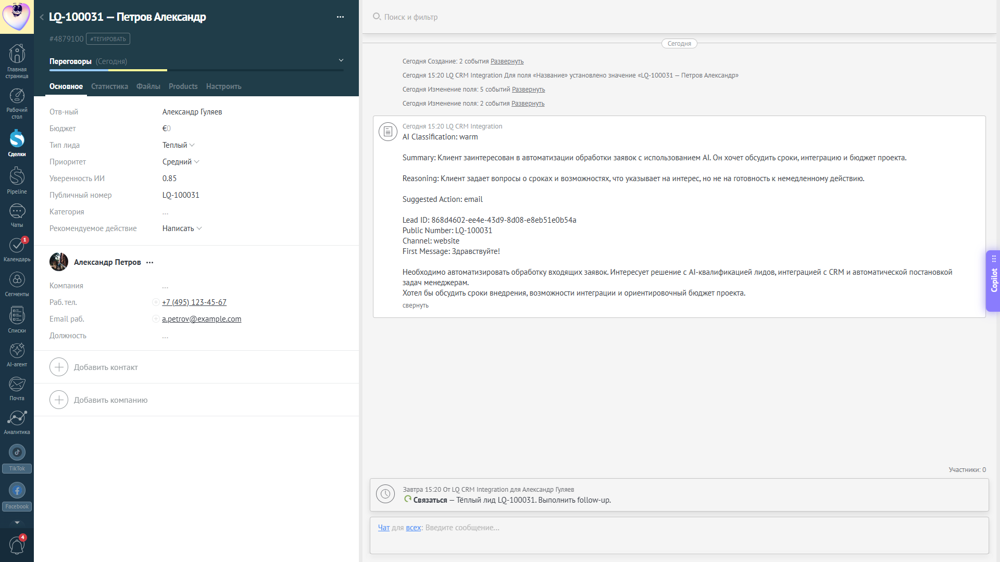

**Холодный лид в CRM**

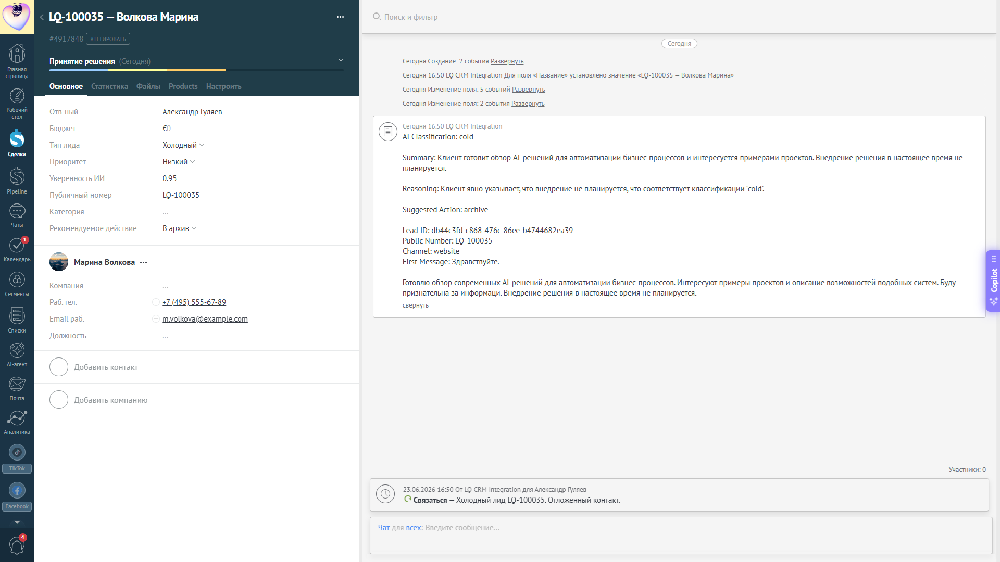

---

### n8n Workflows

**Lead Ingestion Workflow**


- **Что показано**: workflow приёма лидов из Website и Telegram
- **Роль в системе**: точка входа данных
- **Почему важно**: демонстрирует n8n-оркестрацию

**Lead Classification Workflow**


- **Что показано**: AI-классификация с OpenAI и fallback
- **Роль в системе**: ядро квалификации лидов
- **Почему важно**: показывает AI-интеграцию и отказоустойчивость

**Kommo Writer Workflow**


- **Что показано**: запись в Kommo и создание задач
- **Роль в системе**: интеграция с CRM
- **Почему важно**: демонстрирует end-to-end интеграцию

**CRM Status Sync Workflow**


- **Что показано**: периодическая синхронизация статусов
- **Роль в системе**: мониторинг состояния сделок
- **Почему важно**: показывает двустороннюю связь LQ ↔ Kommo

Полная галерея с пояснениями: [Галерея экранов](docs/SCREENSHOTS.md)

---

## Архитектура

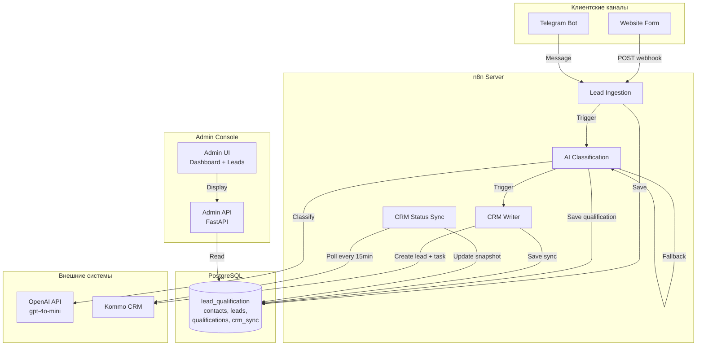

**Семантика потока:**

1. Клиент отправляет заявку через Website или Telegram
2. Lead Ingestion workflow валидирует и сохраняет в PostgreSQL
3. Lead Classification workflow вызывает OpenAI API для классификации
4. При ошибке AI срабатывает rule-based fallback
5. CRM Writer workflow создаёт лид в Kommo с правильным статусом
6. Создаётся задача менеджеру (Hot: +15 мин, Warm: +24 ч, Cold: +7 дней)
7. CRM Status Sync периодически обновляет snapshot в PostgreSQL
8. Admin UI показывает метрики и состояние лидов

Подробности: [Архитектура](docs/ARCHITECTURE.md)

---

## Основные возможности

### Реализовано в MVP

| Возможность | Статус | Описание |
|-------------|--------|----------|
| **Website Lead Capture** | ✅ | Web-форма приём лидов через webhook |
| **Telegram Lead Capture** | ✅ | Telegram-бот для приёма заявок |
| **AI Classification** | ✅ | OpenAI GPT-4o-mini + rule-based fallback |
| **PostgreSQL Storage** | ✅ | Contact-centric data model v2 |
| **Kommo CRM Integration** | ✅ | Создание сделок и задач |
| **Initial Task Creation** | ✅ | Автоматические задачи по типу лида |
| **CRM Status Sync** | ✅ | Периодическая синхронизация snapshot |
| **Admin Console** | ✅ | Dashboard, Lead Queue, Details |
| **Public Client UI** | ✅ | https://lead-qual.alex-n8n.site/ |

### Классификация лидов

| Тип | Описание | CRM Status | Задача |
|-----|----------|------------|--------|
| **hot** | Готов купить немедленно | Входящие → Hot Lead | +15 минут |
| **warm** | Заинтересован, нужен follow-up | Входящие → Warm Lead | +24 часа |
| **cold** | Не готов к решению сейчас | Входящие → Cold Lead | +7 дней |
| **spam** | Нецелевое обращение | Closed → Spam | Не создаётся |

---

## Технологический стек

| Слой | Технология | Версия |
|------|------------|--------|
| **Workflow Engine** | n8n (self-hosted) | Latest |
| **AI Provider** | OpenAI API | gpt-4o-mini |
| **CRM** | Kommo | API v4 |
| **Database** | PostgreSQL | 14+ |
| **Admin Backend** | FastAPI, Python | 3.12 |
| **Admin Frontend** | Vanilla JS | — |
| **Telegram** | Telegram Bot API | — |
| **Reverse Proxy** | Traefik | — |
| **Deploy** | Docker Compose | — |

---

## Быстрый запуск

### Предварительные требования

- Docker и Docker Compose
- OpenAI API ключ
- Telegram Bot Token (опционально)
- Kommo Access Token

### Запуск

```bash
# 1. Клонировать репозиторий
git clone <repository-url>
cd n8n-lead-qualification

# 2. Настроить переменные окружения
cd infra
cp .env.example .env
# Отредактируйте .env с вашими ключами

# 3. Запустить сервисы
docker compose up -d

# 4. Проверить статус
docker compose ps
```

После запуска:

| Сервис | URL |
|--------|-----|
| **Client UI** | http://localhost:5180 |
| **Admin UI** | http://localhost:8080 |
| **n8n UI** | http://localhost:5678 |
| **Admin API** | http://localhost:8000/docs |

Подробные инструкции: [Руководство по развёртыванию](docs/DEPLOYMENT_GUIDE.md)

---

## Структура проекта

```
n8n-lead-qualification/
├── README.md                    # Этот файл
├── docs/                        # Документация
│   ├── ARCHITECTURE.md          # Архитектура системы
│   ├── USER_GUIDE.md            # Руководство пользователя
│   ├── DEPLOYMENT_GUIDE.md      # Руководство по развёртыванию
│   ├── PROJECT_STATE.md         # Текущее состояние
│   ├── PROJECT_HISTORY.md       # История развития
│   ├── IMPLEMENTATION_PLAN.md   # План реализации
│   ├── E2E_SCENARIOS.md         # Сквозные сценарии
│   ├── AI_QUALIFICATION.md      # AI-классификация
│   ├── SCREENSHOTS.md           # Галерея экранов
│   └── TZ_COMPLIANCE_REPORT.md  # Соответствие ТЗ
├── infra/                       # Инфраструктура
│   ├── docker-compose.yml       # Сервисы Docker
│   ├── sql/                      # Схема БД
│   └── docker/                   # Конфигурации Docker
├── admin-ui/                    # Admin Console Frontend
├── admin-backend/               # Admin Console Backend (FastAPI)
├── client-ui/                   # Клиентский UI
├── workflow/                     # n8n workflows
│   └── n8n/workflows/           # JSON экспорт workflows
├── task_history/                # История задач
└── docs/screenshots/            # Скриншоты (плейсхолдеры)
```

---

## Документация

### Основные документы

| Документ | Назначение |
|----------|------------|
| [README.md](README.md) | Введение в проект (этот файл) |
| [ARCHITECTURE.md](docs/ARCHITECTURE.md) | Реализованная архитектура |
| [USER_GUIDE.md](docs/USER_GUIDE.md) | Руководство пользователя |
| [DEPLOYMENT_GUIDE.md](docs/DEPLOYMENT_GUIDE.md) | Развёртывание |
| [PROJECT_STATE.md](docs/PROJECT_STATE.md) | Текущее состояние |

### Специализированные документы

| Документ | Назначение |
|----------|------------|
| [E2E_SCENARIOS.md](docs/E2E_SCENARIOS.md) | Сквозные сценарии работы |
| [AI_QUALIFICATION.md](docs/AI_QUALIFICATION.md) | Логика AI-классификации |
| [SCREENSHOTS.md](docs/SCREENSHOTS.md) | Галерея экранов |
| [TZ_COMPLIANCE_REPORT.md](docs/TZ_COMPLIANCE_REPORT.md) | Соответствие ТЗ |
| [PROJECT_HISTORY.md](docs/PROJECT_HISTORY.md) | Эволюция проекта |

---

## Ограничения MVP

### Текущие ограничения

| Ограничение | Причина | План |
|-------------|---------|------|
| **Polling вместо Event Chaining** | Упрощение MVP | До 5 минут задержка классификации |
| **Single Language (RU)** | Фокус на русскоязычный рынок | Пост-MVP: мультиязычность |
| **Single CRM (Kommo)** | Фокус на одной интеграции | Пост-MVP: Bitrix24 |
| **Keyword Fallback** | Простота реализации | Пост-MVP: semantic similarity |

### Что НЕ реализовано

| Функция | Статус |
|---------|--------|
| Интеграция с Asterisk | Пост-MVP |
| API маркетплейсов (WB/Ozon) | Пост-MVP |
| Голосовые платформы (TTS/STT) | Пост-MVP |
| Мультиагентные системы | v2 |
| A/B тестирование промптов | v2 |

---

## Рыночное подтверждение

**Подтверждающие заказы:**

| Заказ | Платформа | Бюджет | Ключевые требования |
|-------|-----------|--------|---------------------|
| FL.ru #5507855 | n8n + Claude API | 60 000 руб. | 5 AI-агентов для маркетплейсов |
| FL.ru #5508101 | n8n + Asterisk | — | Анализ звонков, интеграция с Битрикс24 |
| FL.ru #5506712 | Мессенджер + Kommo | — | Квалификация водителей такси (Перу) |
| FL.ru #5507454 | Zapier + Kommo + OpenAI | — | Два последовательных запроса к OpenAI |

**Покрытие спроса:** 33% заказов упоминают n8n — критический дефицит портфолио закрыт.

---

## Коммерческая ценность

### Для заказчика

- **Снижение времени отклика** с часов до секунд
- **24/7 доступность** без ночных смен менеджеров
- **Консистентная квалификация** — единые правила для всех лидов
- **Автоматические задачи** — менеджер получает задачу сразу с приоритетом

### Для портфолио

- **Закрывает критический дефицит** — n8n компетенции (33% заказов)
- **База для CRM-интеграций** — Kommo API опыт
- **Переиспользуемые компоненты** — AI classification pipeline, CRM sync pattern

---

## Связанные кейсы

- **Review Flow** — Controlled Hybrid архитектура для обработки обращений
- **Assistant Flow** — AI-платформа для работы с документами
- **Prompt Library** — Библиотека промптов для AI-агентов

---

## Лицензия

MIT License — для демонстрационных целей.

---

## Контакты

- **Public Demo**: https://lead-qual.alex-n8n.site/
- **Admin Demo**: https://lead-qual-admin.alex-n8n.site/
- **Repository**: GitHub (публикация планируется)