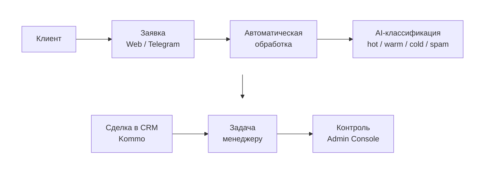

# ⚡ Lead Qualification MVP

<picture>
  <source media="(prefers-color-scheme: dark)" srcset="docs/screenshots/LQ_portfolio_dark.png">
  
</picture>

**Мгновенная квалификация входящих лидов. Автоматическая обработка 24/7. Готовый результат в CRM.**

Система автоматически принимает обращения из Website и Telegram, классифицирует с помощью AI, создаёт сделки в Kommo и ставит задачи менеджеру — горячие лиды через 15 минут, тёплые через 24 часа.

**Результат для бизнеса:**

- ⚡ **Мгновенная реакция** — AI-классификация за секунды, не часы
- 🔄 **24/7 режим** — ночные и выходные лиды не теряются
- 📊 **Автоматическая приоритизация** — hot/warm/cold/spam
- ✅ **CRM-интеграция** — сделки и задачи создаются автоматически
- 👁️ **Прозрачность** — единая консоль мониторинга для руководителя

---

---

## Ключевой бизнес-процесс

**Полный путь лида:**

```mermaid
flowchart TB
    subgraph row1[" "]
        direction LR
        A[Клиент] --> B[Заявка<br>Web / Telegram]
        B --> C[Автоматическая<br>обработка]
        C --> D[AI-классификация<br>hot / warm / cold / spam]
    end
    subgraph row2[" "]
        direction LR
        E[Сделка в CRM<br>Kommo] --> F[Задача<br>менеджеру] --> G[Контроль<br>Admin Console]
    end
    row1 --> row2

    style row1 fill:none,stroke:none
    style row2 fill:none,stroke:none
```

1. **Клиент** оставляет заявку через Website или Telegram
2. **n8n workflow** принимает и сохраняет в PostgreSQL
3. **AI классифицирует:** hot (готов купить), warm (интерес), cold (думает), spam (нецелевой)
4. **Создаётся сделка** в Kommo CRM с правильным статусом воронки
5. **Задача менеджеру** создаётся автоматически по lead_type (Hot: +15 мин, Warm: +24 ч, Cold: +7 дней; spam — сделка закрывается без задачи; приоритет записывается в поле сделки)
6. **Admin Console** показывает состояние всех лидов и CRM-синхронизацию

Подробно: [Демонстрация системы](docs/SYSTEM_DEMO.md)

---

## Демонстрация системы

### Шаг 1. Клиент оставляет заявку

**Вариант 1: Website**

Клиент заполняет форму на сайте, получает подтверждение с номером заявки.

**Вариант 2: Telegram**

Клиент пишет боту, получает мгновенную классификацию.

---

### Шаг 2. Автоматическая обработка

Четыре workflow обрабатывают обращение как единый конвейер (ingestion, classification, CRM-синхронизация, Status Sync):

**Lead Ingestion** — приём из Website/Telegram, валидация, сохранение в БД

**AI Classification** — классификация через OpenAI, fallback при ошибке

**Kommo Writer** — создание сделки и задачи в CRM

---

### Шаг 3. Передача результата в CRM

**Список сделок в Kommo**

**Горячий лид в CRM**

Сделка автоматически получает:
- Статус воронки по lead_type (Первичный контакт / Переговоры / Принимается решение / Закрыто и не реализовано)
- Задачу менеджеру с нужным сроком (hot/warm/cold; spam — без задачи)
- Все данные классификации в примечании

---

### Шаг 4. Контроль процесса

**Очередь лидов для менеджера**

**Dashboard для руководителя**

Результат полного цикла:
- **Менеджер** получает приоритизированную очередь с готовыми данными
- **Руководитель** видит метрики в реальном времени
- **Клиент** получает быстрый отклик

---

## Ценность для бизнеса

### Проблемы, которые решает система

| Проблема | Решение |
|----------|---------|
| **Потеря лидов** | Автоматический приём 24/7 |
| **Медленная реакция** | AI-классификация за секунды |
| **Нет приоритизации** | Автоматическая квалификация hot/warm/cold |
| **Неконсистентность** | Единые правила для всех лидов |
| **Нет контроля** | Централизованная консоль мониторинга |

Подробно: [Ценность для бизнеса](docs/BUSINESS_VALUE.md)

---

## Документация

### Для заказчика

| Документ | Назначение |
|----------|------------|
| [BUSINESS_VALUE.md](docs/BUSINESS_VALUE.md) | Ценность для бизнеса |
| [SYSTEM_DEMO.md](docs/SYSTEM_DEMO.md) | Демонстрация системы |
| [E2E_SCENARIOS.md](docs/E2E_SCENARIOS.md) | Сквозные сценарии |

### Для пользователя

| Документ | Назначение |
|----------|------------|
| [USER_GUIDE.md](docs/USER_GUIDE.md) | Руководство клиента |
| [MANAGER_GUIDE.md](docs/MANAGER_GUIDE.md) | Руководство менеджера |
| [ADMIN_GUIDE.md](docs/ADMIN_GUIDE.md) | Руководство администратора |
| [DEMO_ROUTE.md](docs/DEMO_ROUTE.md) | Быстрая проверка демо |
| [MEDIA_INDEX.md](docs/MEDIA_INDEX.md) | Реестр скриншотов |

### Для инженера

| Документ | Назначение |
|----------|------------|
| [ARCHITECTURE.md](docs/ARCHITECTURE.md) | Архитектура, стек |
| [PROJECT_STRUCTURE.md](docs/PROJECT_STRUCTURE.md) | Карта репозитория |
| [AI_QUALIFICATION.md](docs/AI_QUALIFICATION.md) | Логика AI-классификации |
| [SPEC.md](docs/SPEC.md) | Продуктовая спецификация |
| [IMPLEMENTATION_PLAN.md](docs/IMPLEMENTATION_PLAN.md) | План реализации |
| [PROJECT_HISTORY.md](docs/PROJECT_HISTORY.md) | История развития кейса |
| [DEPLOYMENT_GUIDE.md](docs/DEPLOYMENT_GUIDE.md) | Развёртывание (Source of Truth) |

---

## Рыночное подтверждение

Система закрывает критический дефицит n8n-компетенций в портфолио: анализ реальных заказов на фриланс-площадках показывает устойчивый спрос на n8n-автоматизацию с AI-классификацией и интеграцией CRM (детали — [SPEC.md](docs/SPEC.md) §4).

---

## Лицензия

MIT License — для демонстрационных целей.

---

## Контакты

- **Public Demo**: https://lead-qual.alex-n8n.site/
- **Admin Demo**: https://lead-qual-admin.alex-n8n.site/
- **Repository**: [GitHub — Lead-Qualification-MVP](https://github.com/AlexLvGulyaev/Lead-Qualification-MVP)