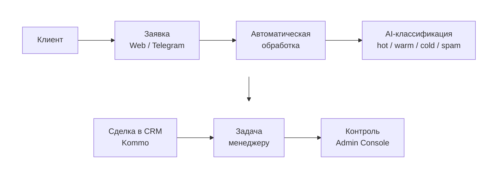

# ⚡ Lead Qualification MVP

<picture>
  <source media="(prefers-color-scheme: dark)" srcset="docs/screenshots/LQ_portfolio_dark.png">
  
</picture>

⚡ **Мгновенная квалификация входящих лидов. Автоматическая обработка 24/7. Готовый результат в CRM.**

Lead Qualification MVP — автоматизация обработки лидов на n8n: система принимает обращения из веб-формы и Telegram, классифицирует с помощью AI, создаёт сделки в Kommo CRM и ставит задачи менеджеру — горячие лиды через 15 минут, тёплые через 24 часа.

- Клиент оставляет заявку на сайте или в Telegram-боте — и сразу получает подтверждение с номером обращения.
- Менеджер получает приоритизированную очередь в CRM: сделка, срок задачи и все данные классификации готовы к работе.
- Руководитель видит метрики и статус CRM-синхронизации в единой консоли мониторинга.

Система не скрывает, как квалифицирован лид: тип, приоритет и confidence сохраняются с обращением и видны в консоли.

[▶️ Попробовать live demo](https://lead-qual.alex-n8n.site) · [💼 Бизнес-ценность](docs/BUSINESS_VALUE.md) · [🎬 Как это работает](docs/SYSTEM_DEMO.md)

---

## ▶️ Live Demo

🌐 **Веб-форма:** [lead-qual.alex-n8n.site](https://lead-qual.alex-n8n.site)

Оставьте обращение — три шага (контакты → описание запроса → источник) — и получите подтверждение с номером заявки.

🤖 **Telegram-бот:** [@OptimusLeadQualificationBot](https://t.me/OptimusLeadQualificationBot)

Диалог с ботом: имя, телефон, e-mail, описание задачи — и мгновенное подтверждение регистрации заявки.

👁️ **Админ-консоль:** [lead-qual-admin.alex-n8n.site](https://lead-qual-admin.alex-n8n.site)

Нажмите **«Войти в демо-режиме»** (read-only) — найдите свою заявку и посмотрите карточку: тип и приоритет (hot / warm / cold / spam), confidence, источник. Полный доступ — только с админ-токеном.

Маршрут проверки демо за 4 шага — [`docs/DEMO_ROUTE.md`](docs/DEMO_ROUTE.md); скриншот-тур и типовой сценарий — [`docs/SYSTEM_DEMO.md`](docs/SYSTEM_DEMO.md).

---

## ❓ Зачем нужен Lead Qualification

Входящие лиды теряются и обрабатываются неравномерно:

| Проблема | Решение |
|----------|---------|
| **Потеря лидов** | Автоматический приём 24/7 — ночные и выходные обращения не пропадают |
| **Медленная реакция** | AI-классификация за секунды, а не часы |
| **Нет приоритизации** | Автоматическая квалификация hot / warm / cold / spam |
| **Неконсистентность** | Единые правила обработки для всех лидов |
| **Нет контроля** | Централизованная консоль мониторинга для руководителя |

Подробно — в [`docs/BUSINESS_VALUE.md`](docs/BUSINESS_VALUE.md).

---

## 🎯 Для кого

- Отделы продаж и малый бизнес, которым нужна реакция на каждый лид без круглосуточного дежурства менеджеров.
- Команды, использующие Kommo CRM и желающие автоматизировать создание сделок и задач.
- Руководители, которым нужен единый экран контроля обработки лидов и CRM-синхронизации.
- Интеграторы: кейс — рабочий референс связки n8n + AI-классификация + CRM.

---

## ✨ Ключевые возможности

- **Приём обращений 24/7** — веб-форма и Telegram-бот с валидацией и мгновенным подтверждением (номер заявки).
- **AI-классификация** — hot / warm / cold / spam с confidence; при недоступности AI — fallback по ключевым словам.
- **CRM-автоматизация** — сделка и задача менеджеру создаются в Kommo по срокам SLA: hot +15 мин, warm +24 ч, cold +7 дней; spam закрывается без задачи.
- **Синхронизация статусов** — snapshot статусов Kommo обновляется в консоли каждые 15 минут.
- **Admin Console** — метрики, очередь лидов с фильтрами, карточка с полной квалификацией и ссылкой на сделку.
- **Безопасность** — Bearer-токены, демо-вход read-only, журнал аудита входов.

---

## 🏗️ Ключевой бизнес-процесс


```mermaid
flowchart TB
    subgraph row1[" "]
        direction LR
        A[Клиент] --> B[Заявка<br>Web / Telegram]
        B --> C[Автоматическая<br>обработка]
        C --> D[AI-классификация<br>hot / warm / cold / spam]
    end
    subgraph row2[" "]
        direction LR
        E[Сделка в CRM<br>Kommo] --> F[Задача<br>менеджеру] --> G[Контроль<br>Admin Console]
    end
    row1 --> row2

    style row1 fill:none,stroke:none
    style row2 fill:none,stroke:none
```

1. **Клиент** оставляет заявку через Website или Telegram
2. **n8n workflow** принимает и сохраняет в PostgreSQL
3. **AI классифицирует:** hot (готов купить), warm (интерес), cold (думает), spam (нецелевой)
4. **Создаётся сделка** в Kommo CRM с правильным статусом воронки
5. **Задача менеджеру** создаётся автоматически по lead_type (Hot: +15 мин, Warm: +24 ч, Cold: +7 дней; spam — сделка закрывается без задачи; приоритет записывается в поле сделки)
6. **Admin Console** показывает состояние всех лидов и CRM-синхронизацию

Подробно: [Демонстрация системы](docs/SYSTEM_DEMO.md)

---

## 🌐 Публичные точки входа

| Роль | Сервис | Адрес | Назначение |
|------|--------|-------|-----------|
| Клиент | Веб-форма | [lead-qual.alex-n8n.site](https://lead-qual.alex-n8n.site) | оставить обращение |
| Клиент | Telegram-бот | [@OptimusLeadQualificationBot](https://t.me/OptimusLeadQualificationBot) | заявка в диалоге |
| Руководитель | Админ-консоль | [lead-qual-admin.alex-n8n.site](https://lead-qual-admin.alex-n8n.site) | метрики, очередь лидов |
| Демо-лендинг | Витрина кейса | [lead-qual-demo.alex-n8n.site](https://lead-qual-demo.alex-n8n.site) | вход во все сервисы |
| Разработчик | Repository | [GitHub — Lead-Qualification-MVP](https://github.com/AlexLvGulyaev/Lead-Qualification-MVP) | исходный код кейса |

> 🔓 **Вход в консоль:** по Bearer-токену (`LQ_ADMIN_TOKEN`); публичный демо-вход — кнопка «Войти в демо-режиме» (`LQ_ADMIN_DEMO_TOKEN`), read-only. Роли и поведение авторизации — [`docs/ADMIN_GUIDE.md`](docs/ADMIN_GUIDE.md).

---

## 📚 Документация

### Для заказчика

| Документ | Назначение |
|----------|------------|
| [💼 `docs/BUSINESS_VALUE.md`](docs/BUSINESS_VALUE.md) | Ценность для бизнеса |
| [🎬 `docs/SYSTEM_DEMO.md`](docs/SYSTEM_DEMO.md) | Демонстрация системы |
| [🧪 `docs/E2E_SCENARIOS.md`](docs/E2E_SCENARIOS.md) | Сквозные сценарии |

### Для пользователя

| Документ | Назначение |
|----------|------------|
| [📝 `docs/USER_GUIDE.md`](docs/USER_GUIDE.md) | Руководство клиента |
| [🤝 `docs/MANAGER_GUIDE.md`](docs/MANAGER_GUIDE.md) | Руководство менеджера |
| [🛡️ `docs/ADMIN_GUIDE.md`](docs/ADMIN_GUIDE.md) | Руководство администратора |
| [🧭 `docs/DEMO_ROUTE.md`](docs/DEMO_ROUTE.md) | Быстрая проверка демо |
| [🖼️ `docs/MEDIA_INDEX.md`](docs/MEDIA_INDEX.md) | Реестр скриншотов |

### Для инженера

| Документ | Назначение |
|----------|------------|
| [🏛️ `docs/ARCHITECTURE.md`](docs/ARCHITECTURE.md) | Архитектура, стек |
| [📂 `docs/PROJECT_STRUCTURE.md`](docs/PROJECT_STRUCTURE.md) | Карта репозитория |
| [🧠 `docs/AI_QUALIFICATION.md`](docs/AI_QUALIFICATION.md) | Логика AI-классификации |
| [📘 `docs/SPEC.md`](docs/SPEC.md) | Продуктовая спецификация |
| [📋 `docs/IMPLEMENTATION_PLAN.md`](docs/IMPLEMENTATION_PLAN.md) | План реализации |
| [📜 `docs/PROJECT_HISTORY.md`](docs/PROJECT_HISTORY.md) | История развития кейса |
| [🚀 `docs/DEPLOYMENT_GUIDE.md`](docs/DEPLOYMENT_GUIDE.md) | Развёртывание (Source of Truth) |

---

## ✅ Статус проекта

Реализованы все компоненты MVP: приём из Website и Telegram, AI-классификация с fallback, хранение в PostgreSQL, интеграция с Kommo (сделки, задачи, статусы), Admin Console, публичный клиентский UI. Живой инстанс работает как витрина (демо-вход read-only).

История развития кейса — в [`docs/PROJECT_HISTORY.md`](docs/PROJECT_HISTORY.md); рыночное подтверждение — в [`docs/SPEC.md`](docs/SPEC.md) §4.

---

## 🛠️ Технологии

- **Workflow Engine** — n8n (self-hosted), Docker Compose.
- **AI-провайдер** — OpenAI API (gpt-4o-mini).
- **CRM** — Kommo (API v4).
- **База данных** — PostgreSQL 14+.
- **Admin Backend** — FastAPI (Python 3.12).
- **Frontends** — статические HTML/JS (клиентская форма, админ-консоль, демо-лендинг).
- **Reverse Proxy** — Traefik (SSL termination, routing).

---

## 🚀 Быстрый запуск

**Требования:** Docker 24.0+, Docker Compose 2.20+, 4 GB RAM.

```bash
git clone https://github.com/AlexLvGulyaev/Lead-Qualification-MVP.git
cd Lead-Qualification-MVP/infra
cp .env.example .env    # заполнить переменные — см. DEPLOYMENT_GUIDE §5
docker compose up -d    # БД инициализируется автоматически при первом запуске
```

| Сервис | URL |
|--------|-----|
| Client UI | http://localhost:5180 |
| Admin UI | http://localhost:8080 |
| Admin API | http://localhost:8000/docs |
| n8n UI | http://localhost:5678 |

После запуска импортируйте 5 n8n workflows ([DEPLOYMENT_GUIDE §8](docs/DEPLOYMENT_GUIDE.md)) и настройте Telegram-вебхук и поля Kommo по гайдам в `docs/`. Полный процесс развёртывания — [🚀 `docs/DEPLOYMENT_GUIDE.md`](docs/DEPLOYMENT_GUIDE.md) (Source of Truth воспроизводимости).

---

## ⚠️ Ограничения демо

- **Классификация по расписанию** — polling каждые 5 минут, до 5 минут задержки (event chaining — в планах).
- **Single language** — только русский язык обращений.
- **Single CRM** — интеграция только с Kommo (Bitrix24 — в планах).
- **Keyword fallback** — при недоступности AI классификация упрощается до ключевых слов.
- Демо-вход в консоль — только чтение; перед production требуются корпоративная аутентификация, мониторинг и бэкапы.

---

## 📁 Структура проекта

Полная карта каталогов и файлов — в [📂 `docs/PROJECT_STRUCTURE.md`](docs/PROJECT_STRUCTURE.md).

> **Примечание:** внутренние материалы AI Automation Portfolio Lab (например, `task_history/`, черновики архитектурных решений) хранятся вне публичного репозитория и не входят в поставку.