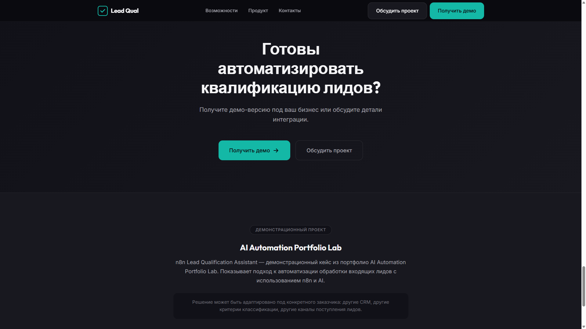

# Ценность для бизнеса

Документ объясняет, какую бизнес-ценность приносит Lead Qualification MVP и какие проблемы решает.

---

## Что такое Lead Qualification MVP

**Lead Qualification MVP** — система автоматической обработки входящих обращений из Website и Telegram с AI-квалификацией, интеграцией с CRM Kommo и централизованной консолью контроля.

Система автоматически принимает обращение, определяет его тип и приоритет, создаёт сделку в CRM и передаёт менеджеру готовый результат для работы.

Руководитель получает полную прозрачность процесса обработки лидов через единую консоль мониторинга.

---

## Какие проблемы бизнеса решает система

### Потеря лидов

**Проблема:** Входящие обращения теряются из-за медленной обработки, отсутствия 24/7 режима или человеческого фактора.

**Решение:** Автоматический приём и классификация обращений 24/7. Ни один лид не останется без внимания.

---

### Медленная реакция

**Проблема:** Клиенты ожидают ответа часами. За это время они успевают уйти к конкурентам.

**Решение:** Мгновенная AI-классификация. Лид определяется как горячий/тёплый/холодный за секунды, а не часы.

---

### Отсутствие приоритизации

**Проблема:** Все лиды обрабатываются одинаково. Менеджер тратит время на нецелевые обращения вместо горячих клиентов.

**Решение:** Автоматическая квалификация по типам: hot — звонок через 15 минут, warm — follow-up через 24 часа, cold — через неделю.

---

### Человеческий фактор

**Проблема:** Разные менеджеры по-разному оценивают одних и тех же клиентов. Квалификация зависит от опыта и настроения.

**Решение:** Единые правила классификации. AI работает по консистентной схеме, результат предсказуем и аудируем.

---

### Отсутствие контроля

**Проблема:** Руководитель не видит состояние обработки лидов в реальном времени.

**Решение:** Централизованная консоль мониторинга с метриками: всего лидов, распределение по типам, статус синхронизации с CRM.

---

## Что получает бизнес после внедрения

### Автоматизация обработки

Заявки из Website и Telegram автоматически принимаются, классифицируются и попадают в CRM без участия менеджера.

- Входящие каналы: Website форма + Telegram-бот
- AI-классификация за секунды
- Автоматическое создание сделки в Kommo

---

### Быстрая реакция

Система определяет тип лида мгновенно. Горячие лиды обрабатываются в приоритетном порядке.

| Тип лида | SLA обработки |
|----------|---------------|
| **Hot** | 15 минут |
| **Warm** | 24 часа |
| **Cold** | 7 дней |

---

### Единые правила квалификации

AI работает по заданной схеме:

- Определяет тип: hot / warm / cold / spam
- Оценивает уровень интереса: high / medium / low
- Устанавливает приоритет обработки
- Рекомендует действие: call / email / archive / reject

Результат предсказуем. Решение можно объяснить.

---

### Контроль качества

Каждое обращение получает:

- **Классификацию** — тип и приоритет
- **Confidence score** — уверенность AI (0.00–1.00)
- **Reasoning** — обоснование решения
- **Рекомендацию** — suggested_action для менеджера

Низкий confidence автоматически помечает лид для проверки.

---

### Прозрачность процесса

Руководитель видит:

- Сколько лидов поступило
- Распределение по типам (hot/warm/cold/spam)
- Статус синхронизации с CRM
- Историю каждого обращения

---

## Ключевые возможности системы

### AI Qualification

Мгновенная классификация обращений с помощью OpenAI GPT-4o-mini. Определение типа лида, уровня интереса и приоритета обработки.

### Lead Scoring

Автоматическая оценка качества лида по множеству факторов. Confidence score показывает уверенность классификации.

### CRM Integration

Бесшовная интеграция с Kommo CRM. Сделки создаются автоматически с правильным статусом воронки.

### Workflow Automation

Полная автоматизация пути лида: приём → классификация → CRM → задача менеджеру.

### Manager Alerts

Автоматическое создание задач с приоритетом. Горячие лиды — через 15 минут, тёплые — через 24 часа.

### Analytics

Единая консоль мониторинга. Метрики в реальном времени: распределение по типам, статус CRM, история обращений.

---

## Измеримый эффект

### Сокращение времени обработки

| До | После |
|----|-------|
| Минуты–часы на первичный отсев | Секунды на AI-классификацию |
| Ожидание ответа менеджера | Автоматическая приоритизация |

---

### Рост скорости реакции

- **Hot лиды:** звонок менеджеру через 15 минут
- **Warm лиды:** follow-up через 24 часа
- **Холодные лиды:** не отвлекают менеджера

---

### Увеличение доли обработанных лидов

- 24/7 режим — ночные и выходные лиды не теряются
- Автоматическая фильтрация спама — менеджер работает только с целевыми обращениями
- Консистентная квалификация — ни один лид не останется без внимания

---

### Повышение прозрачности

- Все лиды в единой системе
- История классификации сохраняется
- Метрики доступны в реальном времени

---

## Почему Lead Qualification MVP отличается от ручной обработки

**Менеджер получает не сырое обращение, а уже квалифицированного лида:**

- ✅ С приоритетом (hot/warm/cold)
- ✅ С AI-резюме (summary, reasoning)
- ✅ С рекомендацией (call/email/archive)
- ✅ С готовой задачей в CRM

| Аспект | Ручная обработка | Lead Qualification MVP |
|--------|------------------|------------------------|
| **Время классификации** | Минуты–часы | Секунды |
| **Доступность** | Рабочие часы | 24/7 |
| **Консистентность** | Зависит от менеджера | Единые правила |
| **Приоритизация** | FIFO или по памяти | Автоматическая по типу |
| **Прозрачность** | Требует отчётов | Консоль мониторинга |
| **Интеграция с CRM** | Вручную | Автоматически |

---

## Как начать

### Быстрый старт

1. **Развертывание** — следуйте [Руководству по развертыванию](DEPLOYMENT_GUIDE.md)
2. **Настройка** — подключите каналы (Website webhook, Telegram bot)
3. **Интеграция** — настройте Kommo CRM
4. **Мониторинг** — используйте Admin Console для контроля

### Демонстрация системы

Полный путь лида через систему: [Демонстрация системы](SYSTEM_DEMO.md)

### Сквозные сценарии

Пошаговые сценарии работы: [Сквозные сценарии](E2E_SCENARIOS.md)

---

## Связанные документы

- [README.md](../README.md) — главное введение в проект
- [SYSTEM_DEMO.md](SYSTEM_DEMO.md) — демонстрация системы
- [USER_GUIDE.md](USER_GUIDE.md) — руководство пользователя
- [E2E_SCENARIOS.md](E2E_SCENARIOS.md) — сквозные сценарии
- [DEPLOYMENT_GUIDE.md](DEPLOYMENT_GUIDE.md) — руководство по развёртыванию

---

