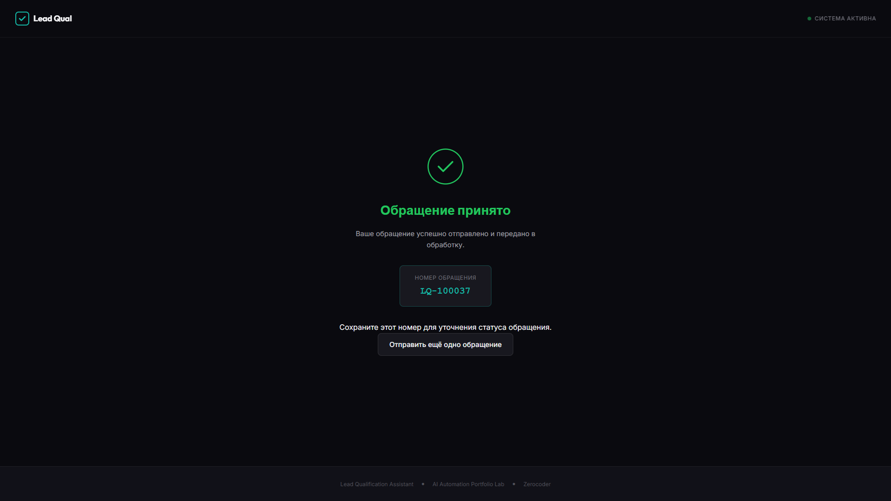
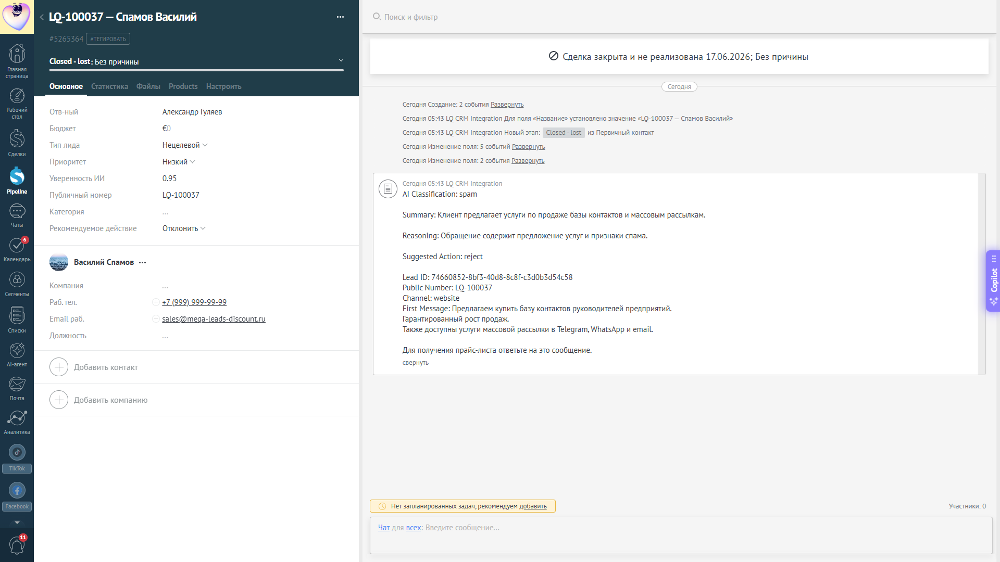
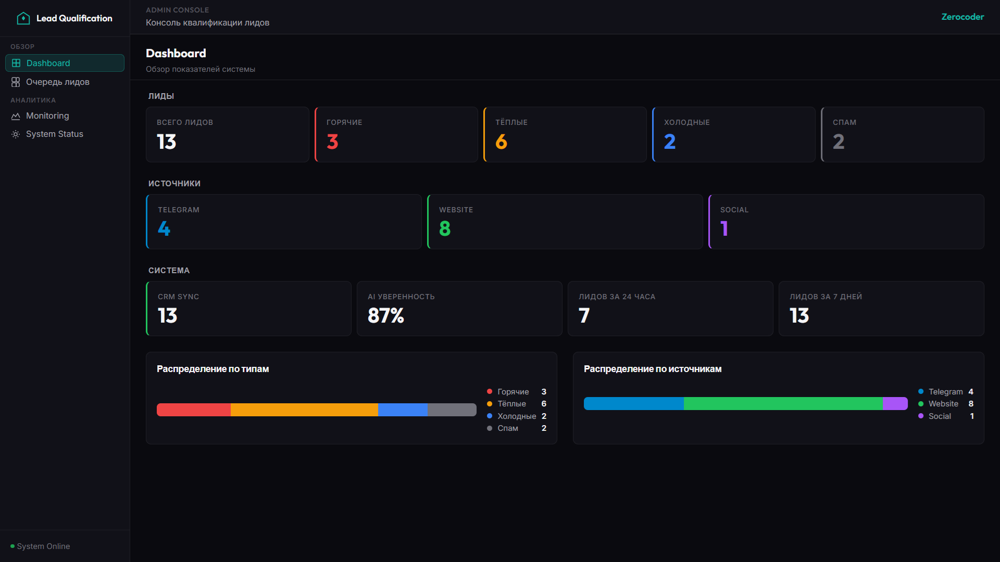

# Сквозные сценарии работы системы

Документ показывает, как обращения проходят через систему Lead Qualification — от момента отправки до результата для бизнеса.

Каждый сценарий демонстрирует конкретный путь обращения: что видит клиент, что получает менеджер, что видит руководитель.

---

## Сценарий 1: Website → Warm Lead

**Номер обращения:** LQ-1000031

Потенциальный клиент оставляет заявку через Website. Его интересует внедрение системы автоматизации. Он хочет обсудить возможности, интеграцию и бюджет.

---

### Исходная ситуация

Клиент заполняет форму на сайте и получает подтверждение приёма заявки.

---

### Путь обращения

**1. Клиент отправляет заявку через Website**

Система подтверждает приём и выдаёт номер обращения.

---

**2. Автоматическая квалификация**

Система анализирует обращение. Определяет: клиент заинтересован, задаёт вопросы, нужен follow-up.

**Результат классификации:** Warm Lead

---

**3. Создание сделки в Kommo**

Система создаёт сделку в CRM:
- Статус: Warm Lead
- Задача менеджеру: через 24 часа
- Все данные клиента переданы

---

**4. Отображение в Dashboard**

Информация о новом обращении появляется в Dashboard. Руководитель видит актуальную статистику.

---

### Результат

**Клиент получает:**
- Подтверждение приёма заявки
- Номер обращения LQ-1000031 для коммуникации
- Ожидание контакта в течение 24 часов

**Менеджер получает:**
- Готовую сделку в Kommo с классификацией
- Все данные клиента
- Автоматическую задачу на звонок через 24 часа
- Рекомендацию: follow-up

**Руководитель получает:**
- Информацию о новом обращении в Dashboard
- Статистику по типам лидов
- Контроль качества обработки

---

## Сценарий 2: Telegram → Hot Lead

**Номер обращения:** LQ-1000032

Клиент обращается через Telegram с запросом, требующим срочной обработки. Готов к быстрому внедрению решения.

---

### Исходная ситуация

Клиент пишет в Telegram-бот с запросом о срочном внедрении.

---

### Путь обращения

**1. Клиент создаёт заявку через Telegram**

Бот подтверждает приём и регистрирует обращение с номером LQ-1000032.

---

**2. Автоматическая квалификация**

Система определяет: клиент готов начать работу, упоминает срочность.

**Результат классификации:** Hot Lead

---

**3. Создание сделки в Kommo**

Система создаёт сделку в CRM:
- Статус: Hot Lead
- Задача менеджеру: через 15 минут
- Все данные клиента переданы

---

**4. Отображение в Dashboard**

Информация о горячем обращении мгновенно появляется в Dashboard.

---

### Результат

**Клиент получает:**
- Мгновенное подтверждение приёма
- Номер обращения LQ-1000032
- Ожидание контакта в течение 15 минут

**Менеджер получает:**
- Приоритетную сделку с пометкой Hot
- Автоматическую задачу на звонок через 15 минут
- Все данные клиента
- Рекомендацию: звонок немедленно

**Руководитель получает:**
- Информацию о горячем обращении в Dashboard
- Контроль скорости реакции менеджера

---

## Сценарий 3: Website → Spam

**Номер обращения:** LQ-1000037

Через Website поступает нецелевое обращение с признаками рекламной рассылки.

---

### Исходная ситуация

Посетитель отправляет форму с рекламным предложением.

---

### Путь обращения

**1. Клиент отправляет обращение через Website**

Система принимает и регистрирует обращение с номером LQ-1000037.

---

**2. Автоматическая квалификация**

Система определяет: нецелевое обращение, рекламный характер, признаки спама.

**Результат классификации:** Spam

---

**3. Отображение в очереди лидов**

Лид появляется в очереди с пометкой Spam. Менеджер видит классификацию.

---

**4. Создание записи в Kommo**

Система создаёт запись в CRM:
- Статус: Closed (Spam)
- Задача: не создаётся
- Информация сохранена для аналитики

---

**5. Статистика в Dashboard**

Обращение учитывается в статистике. Руководитель видит долю спама во входящем потоке.

---

### Результат

**Клиент получает:**
- Подтверждение приёма заявки (как и любое обращение)
- Номер обращения LQ-1000037

**Менеджер получает:**
- Не тратит время на обработку спама
- Запись автоматически закрыта как нецелевая
- Возможность просмотреть в очереди при необходимости

**Руководитель получает:**
- Корректную статистику входящего потока
- Контроль качества фильтрации
- Понимание доли нецелевых обращений

---

## Сводная таблица сценариев

| Сценарий | Источник | Номер обращения | Классификация | Задача менеджеру |
|----------|----------|-----------------|---------------|------------------|
| Warm Lead | Website | LQ-1000031 | Заинтересованный клиент | +24 часа |
| Hot Lead | Telegram | LQ-1000032 | Готов к внедрению | +15 минут |
| Spam | Website | LQ-1000037 | Нецелевое обращение | Не создаётся |

---

## Что показывает документ

**Для бизнеса:**
- Как обращения проходят через систему
- Какие результаты получают stakeholders
- Как автоматизация экономит время

**Для оценки:**
- Конкретные примеры работы системы
- Визуальное подтверждение результатов
- Понятные бизнес-сценарии без технических деталей

---

## Связанные документы

- [SYSTEM_DEMO.md](SYSTEM_DEMO.md) — демонстрация системы
- [BUSINESS_VALUE.md](BUSINESS_VALUE.md) — ценность для бизнеса
- [USER_GUIDE.md](USER_GUIDE.md) — руководство клиента
- [MANAGER_GUIDE.md](MANAGER_GUIDE.md) — руководство менеджера