# 🖼️ Галерея экранов Lead Qualification MVP

**Дата:** 2026-09-15
**Статус:** Реестр всех изображений кейса — назначение, использование, категории. Фактическое содержимое каталога [`docs/screenshots/`](screenshots/) — 37 файлов, все зарегистрированы.

## 👁️ 1. Визуальный контракт

- **Hero самодостаточен** — витринные изображения (`LQ_portfolio_*`) не требуют подписей: смысл передаёт само изображение; alt-текст описывает содержимое для доступности.
- **Hero светлая/тёмная тема** — README подключает пару `LQ_portfolio_light.png` / `LQ_portfolio_dark.png` через `<picture>` по `prefers-color-scheme`.
- **Скриншоты продукта подписаны** — заголовок над изображением называет экран; alt не дублирует подпись.
- **Скриншоты — подтверждение, не замена схемы:** архитектурные связи описываются mermaid-диаграммами, изображения иллюстрируют фактические экраны.

---

## 🗂️ 2. Инвентаризация скриншотов

### Витринные hero (README)

| Файл | Назначение |
|------|------------|
| `LQ_portfolio_light.png` | Витринный hero светлой темы (README, `<picture>`) |
| `LQ_portfolio_dark.png` | Витринный hero тёмной темы (README, `<picture>`) |

### Основные скриншоты (используются в документах)

| Файл | Назначение | Где используется |
|------|------------|------------------|
| `dashboard-overview.png` | Главный экран системы | SYSTEM_DEMO, ADMIN_GUIDE, E2E_SCENARIOS |
| `optimus-bp.png` | Визуализация бизнес-процесса | SYSTEM_DEMO.md |
| `landing-LQ-console.png` | Продуктовый экран | BUSINESS_VALUE.md |
| `landing-problems.png` | Проблемы бизнеса | BUSINESS_VALUE.md |
| `landing-solution.png` | Решение и ценность | BUSINESS_VALUE.md |
| `website-form-success.png` | Успешная отправка Website | SYSTEM_DEMO, USER_GUIDE, E2E_SCENARIOS |
| `telegram-lead-hot.png` | Telegram горячий лид | SYSTEM_DEMO, USER_GUIDE, E2E_SCENARIOS |
| `workflow-lead-ingestion-v2.png` | Workflow приёма лидов | SYSTEM_DEMO, ADMIN_GUIDE, ARCHITECTURE |
| `workflow-lead-classification-mvp.png` | Workflow AI-классификации | SYSTEM_DEMO, ADMIN_GUIDE, ARCHITECTURE |
| `workflow-kommo-writer-mvp.png` | Workflow CRM-интеграции | SYSTEM_DEMO, ADMIN_GUIDE, ARCHITECTURE |
| `kommo-deal-list.png` | Список сделок в CRM | SYSTEM_DEMO, MANAGER_GUIDE |
| `kommo-deal-hot.png` | Горячий лид в CRM | SYSTEM_DEMO, MANAGER_GUIDE, E2E_SCENARIOS |
| `lead-queue-hot.png` | Очередь горячих лидов | SYSTEM_DEMO, ADMIN_GUIDE, MANAGER_GUIDE |
| `landing-link-web.png` | Вход в Web-форму с лендинга | USER_GUIDE.md |
| `landing-link-telegram.png` | Вход в Telegram-бота с лендинга | USER_GUIDE.md |
| `website-form-spam.png` | Нецелевое обращение (сценарий Spam) | E2E_SCENARIOS.md |
| `kommo-deal-spam.png` | Сделка типа Spam в CRM | E2E_SCENARIOS.md |
| `dashboard-overview-spam.png` | Dashboard со спам-статистикой | E2E_SCENARIOS.md |
| `kommo-deal-warm.png` | Сделка типа Warm в CRM | E2E_SCENARIOS.md |
| `website-form-empty.png` | Пустая форма (шаг «открыть форму») | USER_GUIDE.md |
| `lead-queue-spam.png` | Очередь с пометкой Spam | E2E_SCENARIOS.md |

### Резервные скриншоты

| Файл | Статус | Примечание |
|------|--------|------------|
| `website-form-filled.png` | Резерв | Форма с данными |
| `website-form-request.png` | Резерв | Обработка запроса |
| `workflow-crm-status-sync-mvp.png` | Workflow синхронизации статусов CRM | ARCHITECTURE.md |
| `workflow-telegram-lead-ingestion.png` | Резерв | В публичных документах не используется |
| `landing-integration.png` | Резерв | Лендинг |
| `landing-manager.png` | Продуктовый экран (менеджер) | BUSINESS_VALUE.md |
| `landing-features.png` | Секция возможностей | BUSINESS_VALUE.md |
| `landing-STA.png` | Продуктовый экран (STA) | BUSINESS_VALUE.md |
| `landing-hero.png` | Резерв | Лендинг |

### Не использовать без обоснования

| Файл | Причина |
|------|---------|
| `lead-queue-cold.png` | Дублирует структуру hot/warm |
| `lead-queue-warm.png` | Дублирует структуру hot/warm |
| `lead-queue-hot-change-crm-status.png` | Операционный скриншот |
| `kommo-deal-cold.png` | Дублирует структуру hot/warm |
| `kommo-deal-change-status.png` | Операционный скриншот |

---

## 🌐 3. Клиентский контур — Website (Landing)

### Landing: Hero

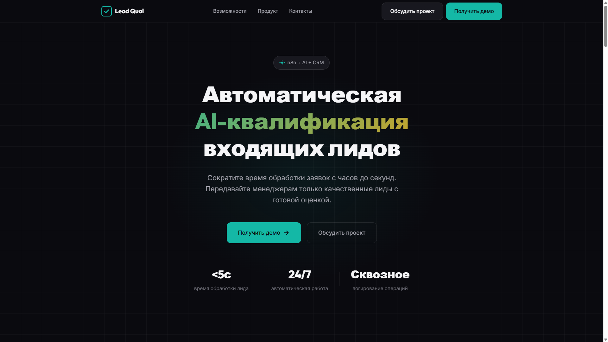

- **Что показано**: главная секция лендинга с заголовком и CTA
- **Роль в системе**: входная точка для клиентов
- **Статус**: Резерв

### Landing: LQ Console

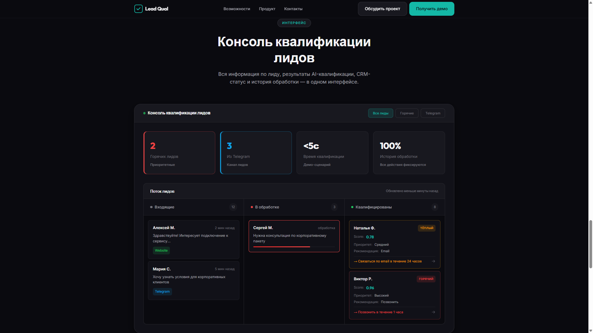

- **Что показано**: продуктовый экран Lead Qualification
- **Роль в системе**: объяснение ценности решения
- **Статус**: Основной (BUSINESS_VALUE.md)

### Landing: Problems

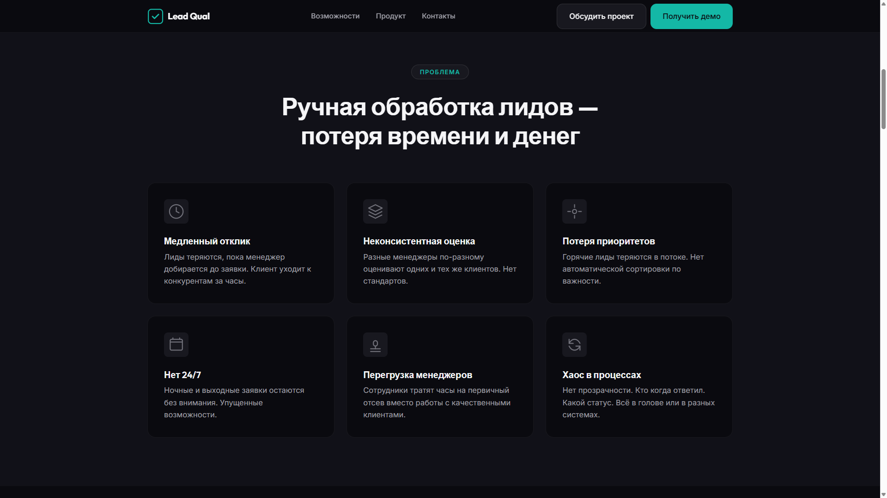

- **Что показано**: секция с описанием проблем клиентов
- **Роль в системе**: объяснение болей целевой аудитории
- **Статус**: Основной (BUSINESS_VALUE.md)

### Landing: Solution

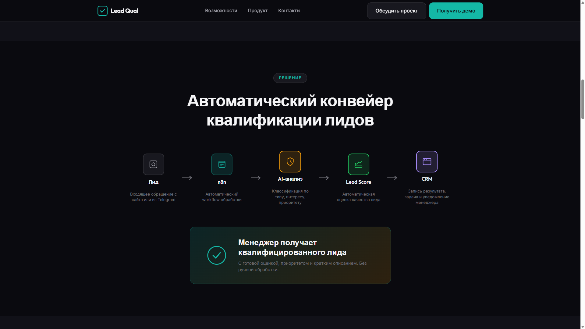

- **Что показано**: секция с описанием решения
- **Роль в системе**: презентация ценности
- **Статус**: Основной (BUSINESS_VALUE.md)

---

## 🌐 4. Клиентский контур — Website (Form)

### Website: Success

- **Что показано**: подтверждение успешной отправки
- **Роль в системе**: финал клиентского сценария
- **Статус**: Основной (SYSTEM_DEMO, USER_GUIDE, E2E_SCENARIOS)

### Website: Filled Form

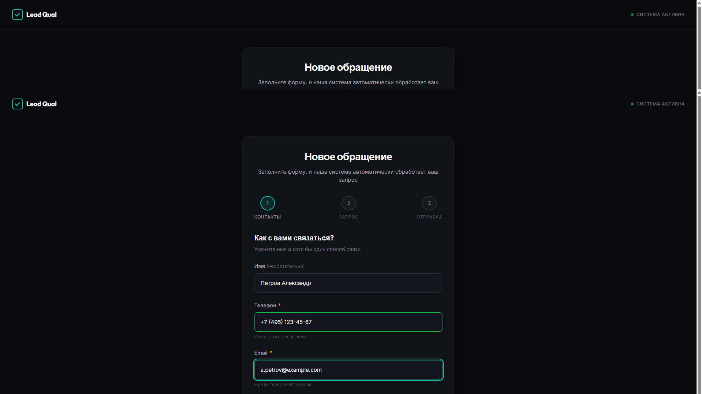

- **Что показано**: форма заявки с заполненными данными
- **Статус**: Резерв

### Website: Request Processing

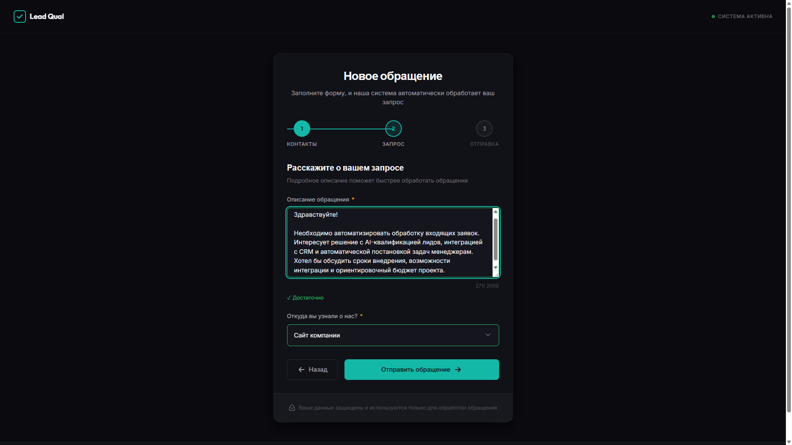

- **Что показано**: состояние обработки запроса
- **Статус**: Резерв

### Website: Empty Form

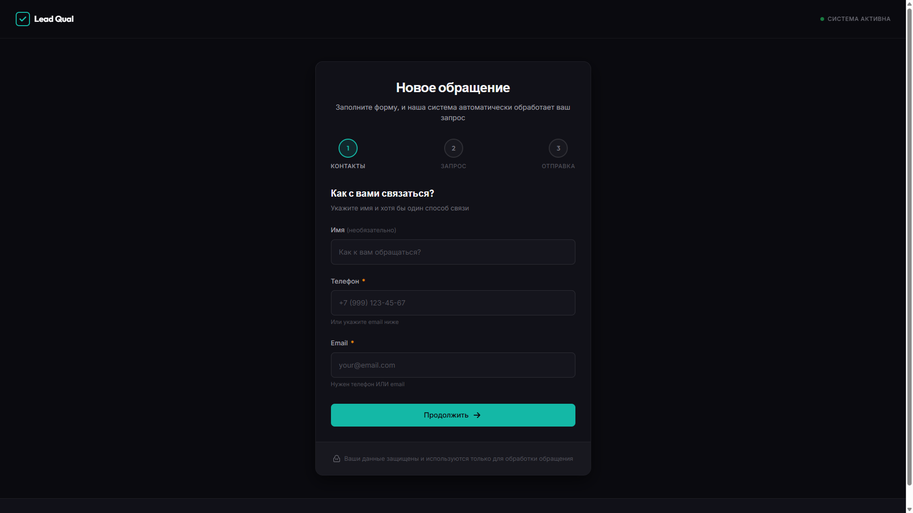

- **Статус**: Не использовать без обоснования

---

## 💬 5. Клиентский контур — Telegram

### Telegram: Hot Lead

- **Что показано**: Telegram-бот, классификация как Hot Lead
- **Роль в системе**: альтернативный канал входа лидов
- **Статус**: Основной (SYSTEM_DEMO, USER_GUIDE, E2E_SCENARIOS)

---

## 🖥️ 6. Admin Console — Dashboard

### Dashboard: Overview

- **Что показано**: главная страница Admin Console с метриками
- **Роль в системе**: оперативный мониторинг системы
- **Статус**: Основной (SYSTEM_DEMO, ADMIN_GUIDE, E2E_SCENARIOS)

---

## 🖥️ 7. Admin Console — Lead Queue

### Lead Queue: Hot

- **Что показано**: список лидов с фильтром по Hot
- **Роль в системе**: рабочее место менеджера
- **Статус**: Основной (SYSTEM_DEMO, ADMIN_GUIDE, MANAGER_GUIDE)

### Lead Queue: Warm

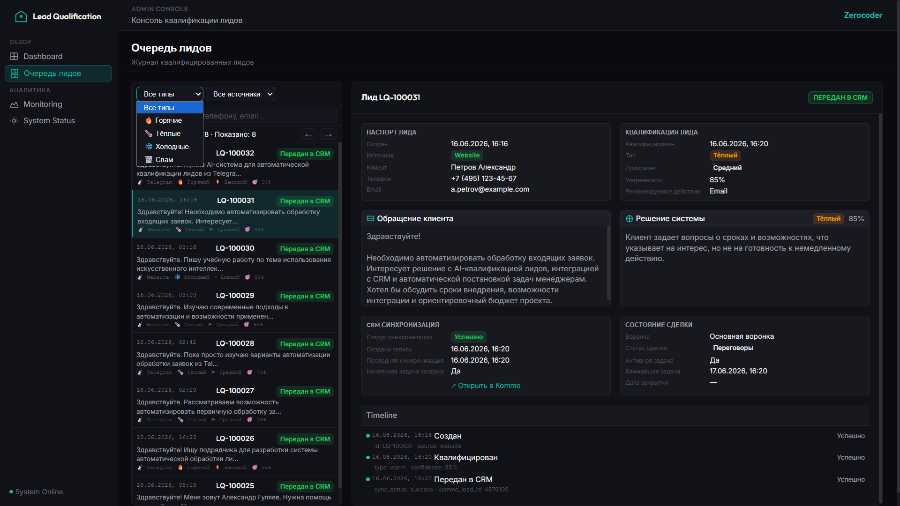

- **Статус**: Не использовать без обоснования (дублирует структуру hot)

### Lead Queue: Cold

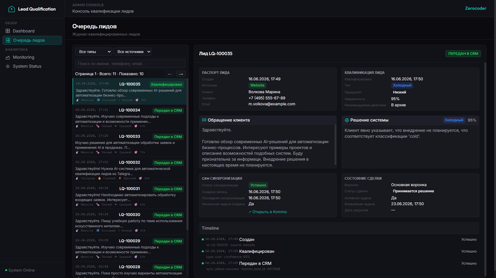

- **Статус**: Не использовать без обоснования (дублирует структуру hot)

### Lead Queue: Spam

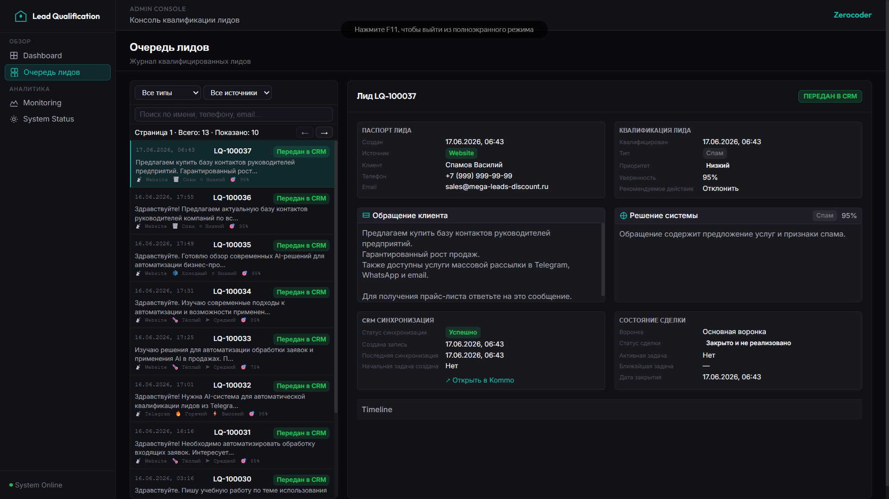

- **Статус**: Основной (E2E_SCENARIOS)

### Lead Queue: Change CRM Status

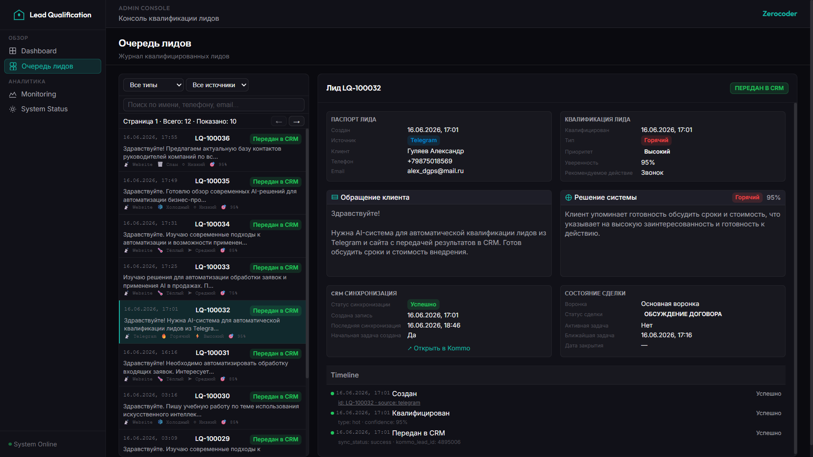

- **Статус**: Не использовать без обоснования (операционный скриншот)

---

## ⚙️ 8. n8n Workflows

### Workflow: Lead Ingestion V2

- **Что показано**: workflow приёма лидов из Website
- **Роль в системе**: точка входа данных
- **Статус**: Основной (SYSTEM_DEMO, ADMIN_GUIDE, ARCHITECTURE)

### Workflow: Telegram Lead Ingestion

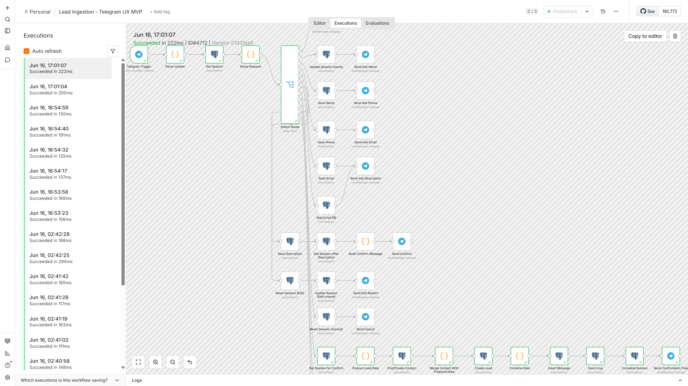

- **Статус**: Резерв (в публичных документах не используется)

### Workflow: Lead Classification MVP

- **Что показано**: AI-классификация с OpenAI и fallback
- **Роль в системе**: ядро квалификации
- **Статус**: Основной (SYSTEM_DEMO, ADMIN_GUIDE, ARCHITECTURE)

### Workflow: Kommo Writer MVP

- **Что показано**: создание сделок и задач в Kommo
- **Роль в системе**: CRM-интеграция
- **Статус**: Основной (SYSTEM_DEMO, ADMIN_GUIDE, ARCHITECTURE)

### Workflow: CRM Status Sync MVP

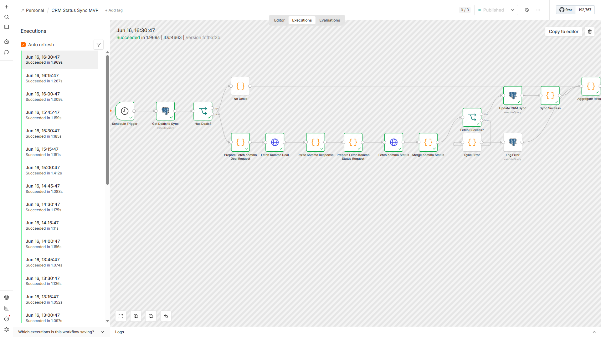

- **Что показано**: snapshot статусов Kommo по расписанию
- **Роль в системе**: обратная связь из CRM в консоль
- **Статус**: Основной (ARCHITECTURE)

---

## 🏷️ 9. Kommo CRM

### Kommo: Deal List

- **Что показано**: список сделок в Kommo
- **Роль в системе**: результат CRM Writer
- **Статус**: Основной (SYSTEM_DEMO, MANAGER_GUIDE)

### Kommo: Deal Hot

- **Что показано**: сделка типа Hot в Kanban
- **Статус**: Основной (SYSTEM_DEMO, MANAGER_GUIDE, E2E_SCENARIOS)

### Kommo: Deal Warm

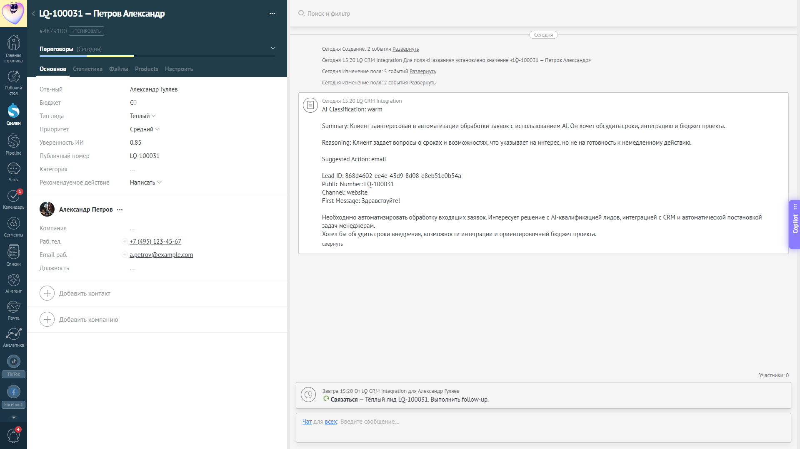

- **Что показано**: сделка типа Warm в Kanban
- **Статус**: Основной (E2E_SCENARIOS)

### Kommo: Deal Cold

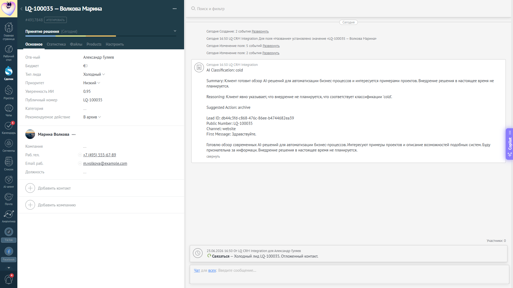

- **Статус**: Не использовать без обоснования (дублирует структуру hot)

### Kommo: Change Status

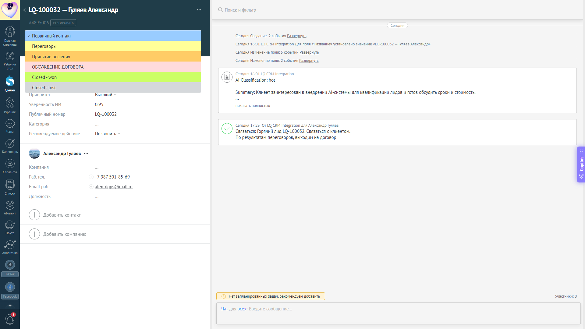

- **Статус**: Не использовать без обоснования (операционный скриншот)

---

## 🗺️ 10. Бизнес-процесс

### Optimus BP

- **Что показано**: визуализация ключевого бизнес-процесса
- **Роль в системе**: объяснение потока лидов
- **Статус**: Основной (SYSTEM_DEMO.md)

---

## 📊 11. Сводная таблица скриншотов

| Категория | Hero | Основные | Резерв | Не использовать | Итого |
|-----------|------|----------|--------|-----------------|-------|
| Витринные hero | 2 | — | — | — | 2 |
| Landing | — | 8 | 2 | — | 10 |
| Website Form | — | 3 | 2 | — | 5 |
| Telegram | — | 1 | — | — | 1 |
| Dashboard | — | 2 | — | — | 2 |
| Lead Queue | — | 2 | — | 3 | 5 |
| Workflows | — | 4 | 1 | — | 5 |
| Kommo CRM | — | 4 | — | 2 | 6 |
| Бизнес-процесс | — | 1 | — | — | 1 |
| **Итого** | **2** | **25** | **5** | **5** | **37** |

---

## 🔗 12. Использование в документации

| Документ | Скриншоты |
|----------|-----------|
| [README.md](../README.md) | LQ_portfolio_light/dark (hero) — единственные изображения README; схемы — Mermaid |
| [BUSINESS_VALUE.md](BUSINESS_VALUE.md) | landing-LQ-console, landing-problems, landing-solution, landing-features, landing-manager, landing-STA |
| [SYSTEM_DEMO.md](SYSTEM_DEMO.md) | optimus-bp, website-form-success, telegram-lead-hot, workflow-*, kommo-deal-list/hot, lead-queue-hot, dashboard-overview |
| [USER_GUIDE.md](USER_GUIDE.md) | landing-link-web, landing-link-telegram, website-form-empty/filled/request/success, telegram-lead-hot |
| [E2E_SCENARIOS.md](E2E_SCENARIOS.md) | website-form-success/spam, telegram-lead-hot, kommo-deal-warm/hot/spam, lead-queue-spam, dashboard-overview/spam |
| [MANAGER_GUIDE.md](MANAGER_GUIDE.md) | kommo-deal-list/hot, lead-queue-hot |
| [ADMIN_GUIDE.md](ADMIN_GUIDE.md) | dashboard-overview, lead-queue-hot, workflow-lead-ingestion-v2/classification-mvp/kommo-writer-mvp |
| [ARCHITECTURE.md](ARCHITECTURE.md) | LQ_portfolio_dark (hero), workflow-lead-ingestion-v2/classification-mvp/kommo-writer-mvp/crm-status-sync-mvp |