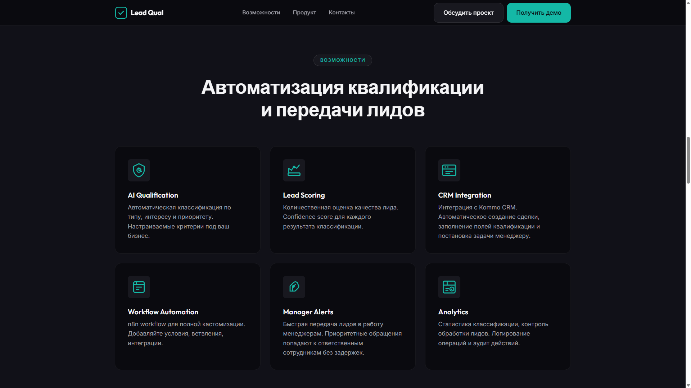
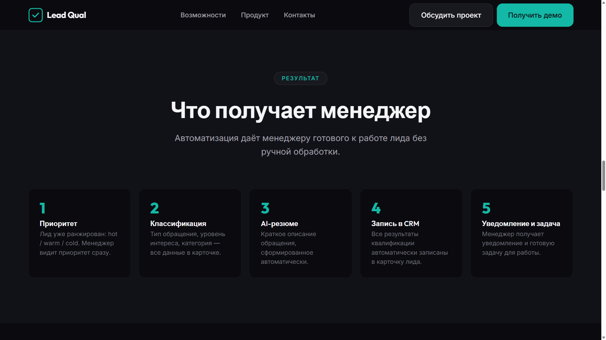
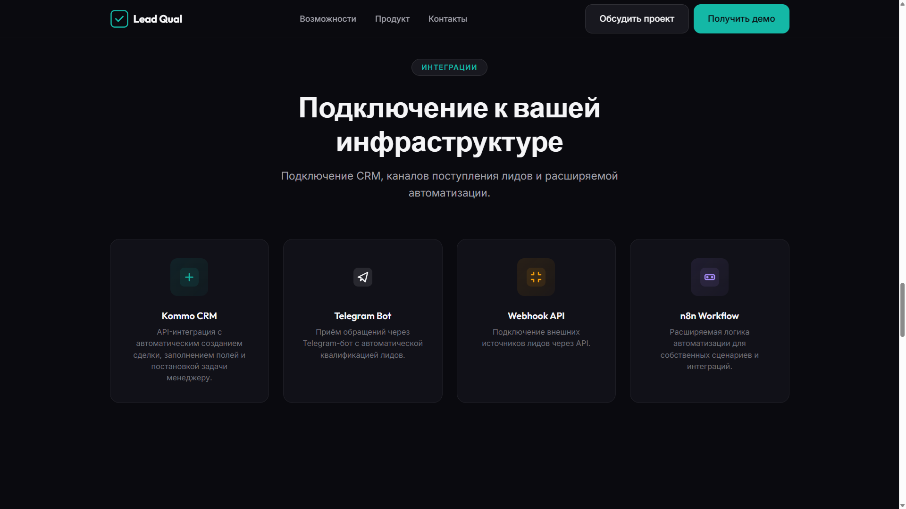
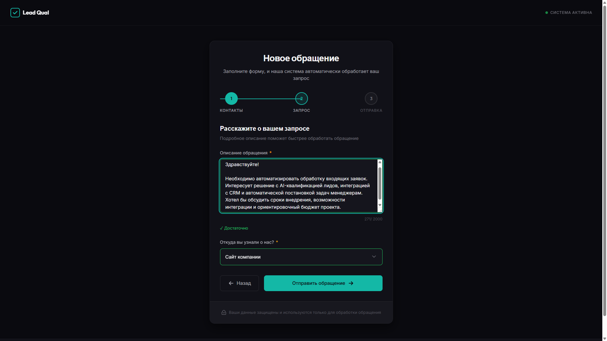
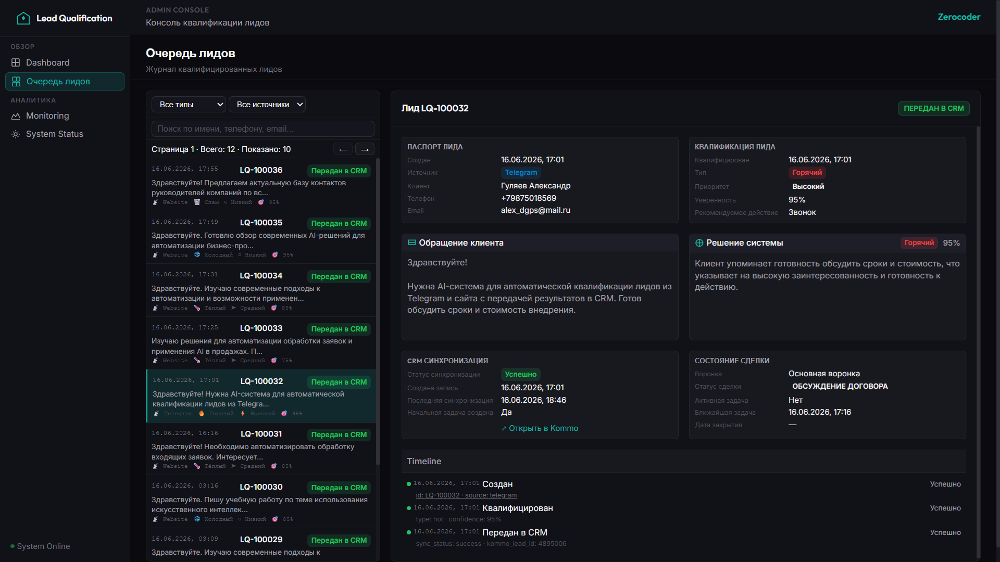
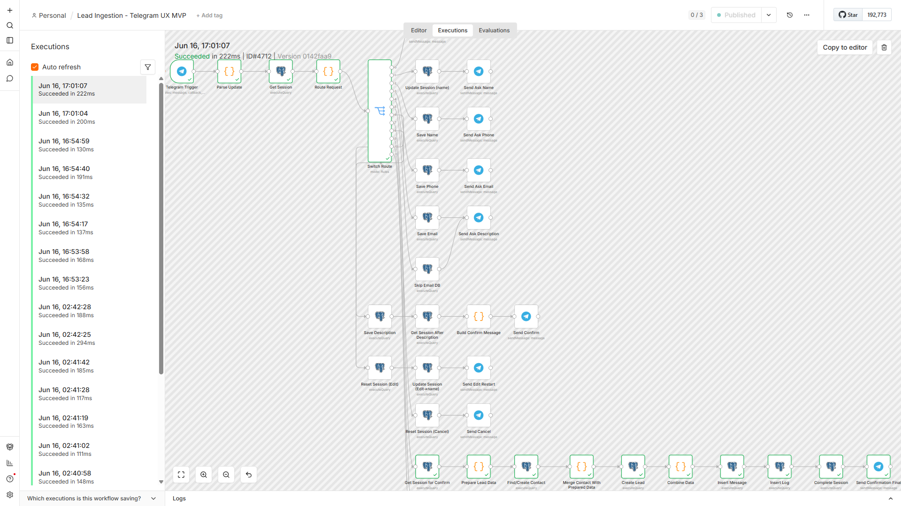
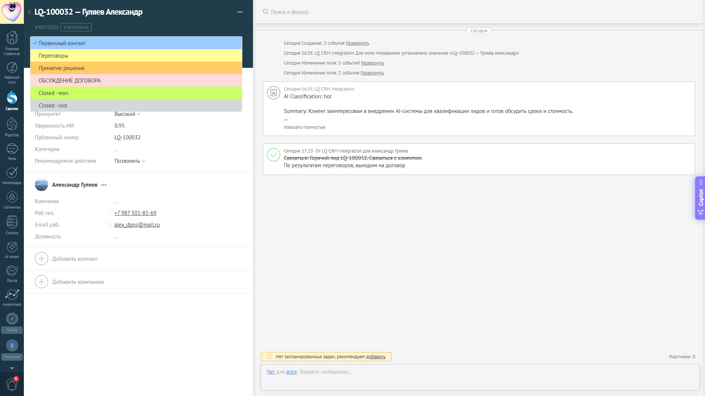

# Галерея экранов Lead Qualification MVP

Все изображения — реальные скриншоты из каталога [`docs/screenshots/`](screenshots/).
Цель галереи — показать проект как законченный демонстрационный MVP: каналы входа, AI-классификация, CRM-интеграция и мониторинг.

---

## 1) Клиентский контур — Website (Landing)

### Landing: Hero

- **Что показано**: главная секция лендинга с заголовком и CTA
- **Роль в системе**: входная точка для клиентов
- **Почему важно**: первое впечатление клиента о системе

### Landing: Problems

- **Что показано**: секция с описанием проблем клиентов
- **Роль в системе**: объяснение ценности решения
- **Почему важно**: демонстрирует понимание болей клиента

### Landing: Solution

- **Что показано**: секция с описанием решения
- **Роль в системе**: презентация системы
- **Почему важно**: объясняет как система решает проблемы

### Landing: Features

- **Что показано**: ключевые возможности системы
- **Роль в системе**: демонстрация функциональности
- **Почему важно**: показывает что клиент получает

### Landing: Manager

- **Что показано**: секция для менеджеров
- **Роль в системе**: объяснение пользы для менеджеров
- **Почему важно**: показывает интеграцию с работой менеджера

### Landing: Integration

- **Что показано**: секция интеграций
- **Роль в системе**: связь с CRM
- **Почему важно**: демонстрирует интеграцию с Kommo

---

## 2) Клиентский контур — Website (Form)

### Website: Empty Form

- **Что показано**: форма заявки до заполнения
- **Роль в системе**: точка входа Website-лидов
- **Почему важно**: демонстрирует клиентский интерфейс

### Website: Filled Form

- **Что показано**: форма заявки с заполненными данными
- **Роль в системе**: сбор данных клиента
- **Почему важно**: показывает требуемые поля

### Website: Request Processing

- **Что показано**: состояние обработки запроса
- **Роль в системе**: обратная связь клиенту
- **Почему важно**: показывает процесс обработки

### Website: Success

- **Что показано**: подтверждение успешной отправки
- **Роль в системе**: финал клиентского сценария
- **Почему важно**: показывает номер заявки LQ-XXXXXX

---

## 3) Клиентский контур — Telegram

### Telegram: Hot Lead

- **Что показано**: Telegram-бот, классификация как Hot Lead
- **Роль в системе**: альтернативный канал входа лидов
- **Почему важно**: демонстрирует мультиканальность системы
- **Особенности**: inline-кнопки, confirmation, LQ-номер

---

## 4) Admin Console — Dashboard

### Dashboard: Overview

- **Что показано**: главная страница Admin Console с метриками
- **Роль в системе**: оперативный мониторинг системы
- **Почему важно**: ключевые метрики на одном экране
- **Метрики**: всего лидов, распределение по типам, CRM sync

---

## 5) Admin Console — Lead Queue

### Lead Queue: Hot

- **Что показано**: список лидов с фильтром по Hot
- **Роль в системе**: рабочее место администратора
- **Почему важно**: показывает результат AI-классификации
- **Поля**: номер, имя, тип, приоритет, уверенность, источник

### Lead Queue: Warm

- **Что показано**: список лидов с фильтром по Warm
- **Роль в системе**: просмотр теплых лидов
- **Почему важно**: демонстрирует фильтрацию по типам

### Lead Queue: Cold

- **Что показано**: список лидов с фильтром по Cold
- **Роль в системе**: просмотр холодных лидов
- **Почему важно**: показывает разные типы классификации

### Lead Queue: Spam

- **Что показано**: список лидов с фильтром по Spam
- **Роль в системе**: просмотр спама
- **Почему важно**: демонстрирует фильтрацию нецелевых обращений

### Lead Queue: Change CRM Status

- **Что показано**: детальный просмотр лида со ссылкой на CRM
- **Роль в системе**: связь LQ ↔ Kommo
- **Почему важно**: показывает интеграцию без входа в CRM

---

## 6) n8n Workflows

### Workflow: Lead Ingestion V2

- **Что показано**: workflow приёма лидов из Website
- **Роль в системе**: точка входа данных
- **Почему важно**: демонстрирует n8n-оркестрацию
- **Ноды**: Webhook, Validate, Find/Create Contact, Create Lead

### Workflow: Telegram Lead Ingestion

- **Что показано**: workflow приёма лидов из Telegram
- **Роль в системе**: Telegram-канал
- **Почему важно**: показывает мультиканальность на уровне n8n
- **Ноды**: Telegram Trigger, Parse, UX, Find/Create Contact

### Workflow: Lead Classification MVP

- **Что показано**: AI-классификация с OpenAI и fallback
- **Роль в системе**: ядро квалификации
- **Почему важно**: демонстрирует AI-интеграцию и отказоустойчивость
- **Ноды**: Schedule, Query, OpenAI, Fallback, Save

### Workflow: Kommo Writer MVP

- **Что показано**: создание сделок и задач в Kommo
- **Роль в системе**: CRM-интеграция
- **Почему важно**: демонстрирует end-to-end интеграцию
- **Ноды**: Webhook, Prepare Payload, Kommo API, Create Task

### Workflow: CRM Status Sync MVP

- **Что показано**: периодическая синхронизация snapshot
- **Роль в системе**: мониторинг CRM-состояния
- **Почему важно**: показывает polling-подход
- **Ноды**: Schedule, Query, Kommo API, Update DB

---

## 7) Kommo CRM

### Kommo: Deal List

- **Что показано**: список сделок в Kommo
- **Роль в системе**: результат CRM Writer
- **Почему важно**: подтверждает работу интеграции
- **Поля**: Name, Pipeline, Status, Custom Fields

### Kommo: Deal Hot

- **Что показано**: сделка типа Hot в Kanban
- **Роль в системе**: классификация Hot Lead
- **Почему важно**: демонстрирует маппинг lead_type → status

### Kommo: Deal Warm

- **Что показано**: сделка типа Warm в Kanban
- **Роль в системе**: классификация Warm Lead
- **Почему важно**: показывает разные колонки воронки

### Kommo: Deal Cold

- **Что показано**: сделка типа Cold в Kanban
- **Роль в системе**: классификация Cold Lead
- **Почему важно**: демонстрирует низкоприоритетную воронку

### Kommo: Change Status

- **Что показано**: изменение статуса сделки в Kommo
- **Роль в системе**: менеджер работает с сделкой
- **Почему важно**: показывает Sales Execution SOT

---

## Сводная таблица скриншотов

| Категория | Количество | Файлы |
|-----------|------------|-------|
| Landing | 8 | landing-*.png |
| Website Form | 4 | website-form-*.png |
| Telegram | 1 | telegram-*.png |
| Dashboard | 1 | dashboard-*.png |
| Lead Queue | 5 | lead-queue-*.png |
| Workflows | 5 | workflow-*.png |
| Kommo CRM | 5 | commo-*.png |
| **Итого** | **29** | |

---

## Использование в документации

Скриншоты используются в:
- [README.md](../README.md) — обзор проекта
- [USER_GUIDE.md](USER_GUIDE.md) — руководство пользователя
- [E2E_SCENARIOS.md](E2E_SCENARIOS.md) — сквозные сценарии
- [ARCHITECTURE.md](ARCHITECTURE.md) — архитектура системы