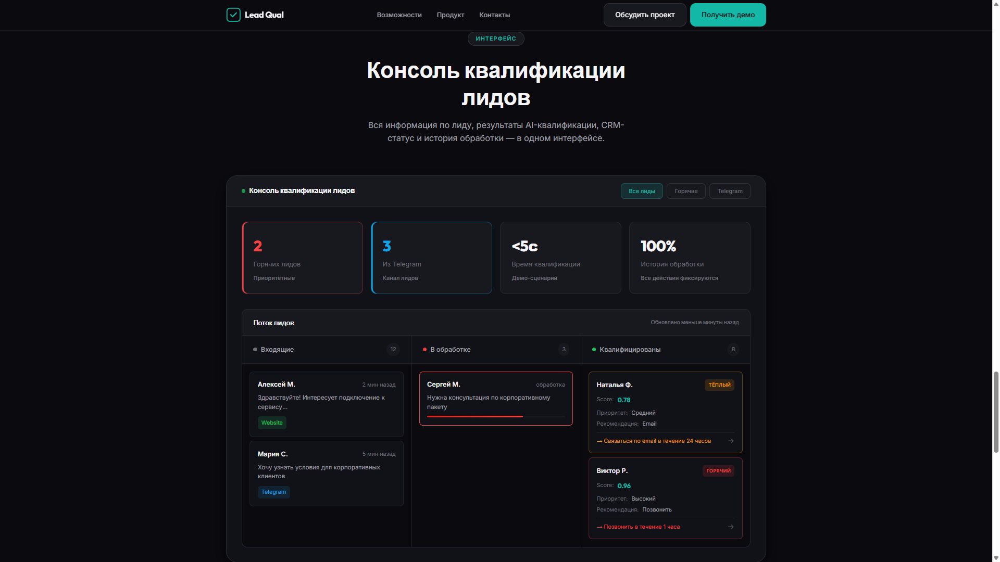

# Галерея экранов Lead Qualification MVP

Все изображения — реальные скриншоты из каталога [`docs/screenshots/`](screenshots/).

---

## Инвентаризация скриншотов

### Основные скриншоты (используются в README и документах)

| Файл | Назначение | Где используется |
|------|------------|------------------|
| `dashboard-overview.png` | Главный экран системы | README.md, SYSTEM_DEMO.md |
| `optimus-bp.png` | Визуализация бизнес-процесса | README.md, SYSTEM_DEMO.md |
| `landing-LQ-console.png` | Продуктовый экран | BUSINESS_VALUE.md |
| `landing-problems.png` | Проблемы бизнеса | BUSINESS_VALUE.md |
| `landing-solution.png` | Решение и ценность | BUSINESS_VALUE.md |
| `website-form-success.png` | Успешная отправка Website | README.md, SYSTEM_DEMO.md |
| `telegram-lead-hot.png` | Telegram горячий лид | README.md, SYSTEM_DEMO.md |
| `workflow-lead-ingestion-v2.png` | Workflow приёма лидов | README.md, SYSTEM_DEMO.md |
| `workflow-lead-classification-mvp.png` | Workflow AI-классификации | README.md, SYSTEM_DEMO.md |
| `workflow-kommo-writer-mvp.png` | Workflow CRM-интеграции | README.md, SYSTEM_DEMO.md |
| `commo-deal-list.png` | Список сделок в CRM | README.md, SYSTEM_DEMO.md |
| `commo-deal-hot.png` | Горячий лид в CRM | README.md, SYSTEM_DEMO.md |
| `lead-queue-hot.png` | Очередь горячих лидов | README.md, SYSTEM_DEMO.md |

### Резервные скриншоты

| Файл | Статус | Примечание |
|------|--------|------------|
| `website-form-filled.png` | Резерв | Форма с данными |
| `website-form-request.png` | Резерв | Обработка запроса |
| `workflow-crm-status-sync-mvp.png` | Резерв | Архитектурные документы |
| `workflow-telegram-lead-ingestion.png` | Резерв | Архитектурные документы |
| `landing-integration.png` | Резерв | Лендинг |
| `landing-manager.png` | Резерв | Лендинг |
| `landing-features.png` | Резерв | Лендинг |
| `landing-STA.png` | Резерв | Лендинг |
| `landing-hero.png` | Резерв | Лендинг |

### Не использовать без обоснования

| Файл | Причина |
|------|---------|
| `website-form-empty.png` | Пустая форма не показывает ценность |
| `lead-queue-cold.png` | Дублирует структуру hot/warm |
| `lead-queue-spam.png` | Дублирует структуру hot/warm |
| `lead-queue-warm.png` | Дублирует структуру hot/warm |
| `commo-deal-warm.png` | Дублирует структуру hot |
| `commo-deal-cold.png` | Дублирует структуру hot |
| `commo-deal-change-status.png` | Операционный скриншот |
| `lead-queue-hot-change-crm-status.png` | Операционный скриншот |

---

## 1) Клиентский контур — Website (Landing)

### Landing: Hero

- **Что показано**: главная секция лендинга с заголовком и CTA
- **Роль в системе**: входная точка для клиентов
- **Статус**: Резерв

### Landing: LQ Console

- **Что показано**: продуктовый экран Lead Qualification
- **Роль в системе**: объяснение ценности решения
- **Статус**: Основной (BUSINESS_VALUE.md)

### Landing: Problems

- **Что показано**: секция с описанием проблем клиентов
- **Роль в системе**: объяснение болей целевой аудитории
- **Статус**: Основной (BUSINESS_VALUE.md)

### Landing: Solution

- **Что показано**: секция с описанием решения
- **Роль в системе**: презентация ценности
- **Статус**: Основной (BUSINESS_VALUE.md)

---

## 2) Клиентский контур — Website (Form)

### Website: Success

- **Что показано**: подтверждение успешной отправки
- **Роль в системе**: финал клиентского сценария
- **Статус**: Основной (README.md, SYSTEM_DEMO.md)

### Website: Filled Form

- **Что показано**: форма заявки с заполненными данными
- **Статус**: Резерв

### Website: Request Processing

- **Что показано**: состояние обработки запроса
- **Статус**: Резерв

### Website: Empty Form

- **Статус**: Не использовать без обоснования

---

## 3) Клиентский контур — Telegram

### Telegram: Hot Lead

- **Что показано**: Telegram-бот, классификация как Hot Lead
- **Роль в системе**: альтернативный канал входа лидов
- **Статус**: Основной (README.md, SYSTEM_DEMO.md)

---

## 4) Admin Console — Dashboard

### Dashboard: Overview

- **Что показано**: главная страница Admin Console с метриками
- **Роль в системе**: оперативный мониторинг системы
- **Статус**: Основной (README.md, SYSTEM_DEMO.md)

---

## 5) Admin Console — Lead Queue

### Lead Queue: Hot

- **Что показано**: список лидов с фильтром по Hot
- **Роль в системе**: рабочее место менеджера
- **Статус**: Основной (README.md, SYSTEM_DEMO.md)

### Lead Queue: Warm

- **Статус**: Резерв (дублирует структуру hot)

### Lead Queue: Cold

- **Статус**: Резерв (дублирует структуру hot)

### Lead Queue: Spam

- **Статус**: Резерв (дублирует структуру hot)

### Lead Queue: Change CRM Status

- **Статус**: Резерв

---

## 6) n8n Workflows

### Workflow: Lead Ingestion V2

- **Что показано**: workflow приёма лидов из Website
- **Роль в системе**: точка входа данных
- **Статус**: Основной (README.md, SYSTEM_DEMO.md)

### Workflow: Telegram Lead Ingestion

- **Статус**: Резерв (архитектурные документы)

### Workflow: Lead Classification MVP

- **Что показано**: AI-классификация с OpenAI и fallback
- **Роль в системе**: ядро квалификации
- **Статус**: Основной (README.md, SYSTEM_DEMO.md)

### Workflow: Kommo Writer MVP

- **Что показано**: создание сделок и задач в Kommo
- **Роль в системе**: CRM-интеграция
- **Статус**: Основной (README.md, SYSTEM_DEMO.md)

### Workflow: CRM Status Sync MVP

- **Статус**: Резерв (архитектурные документы)

---

## 7) Kommo CRM

### Kommo: Deal List

- **Что показано**: список сделок в Kommo
- **Роль в системе**: результат CRM Writer
- **Статус**: Основной (README.md, SYSTEM_DEMO.md)

### Kommo: Deal Hot

- **Что показано**: сделка типа Hot в Kanban
- **Статус**: Основной (README.md, SYSTEM_DEMO.md)

### Kommo: Deal Warm

- **Статус**: Резерв (дублирует структуру hot)

### Kommo: Deal Cold

- **Статус**: Резерв (дублирует структуру hot)

### Kommo: Change Status

- **Статус**: Резерв

---

## 8) Бизнес-процесс

### Optimus BP

- **Что показано**: визуализация ключевого бизнес-процесса
- **Роль в системе**: объяснение потока лидов
- **Статус**: Основной (README.md, SYSTEM_DEMO.md)

---

## Сводная таблица скриншотов

| Категория | Основные | Резерв | Итого |
|-----------|----------|--------|-------|
| Landing | 3 | 5 | 8 |
| Website Form | 1 | 2 | 3 |
| Telegram | 1 | 0 | 1 |
| Dashboard | 1 | 0 | 1 |
| Lead Queue | 1 | 4 | 5 |
| Workflows | 3 | 2 | 5 |
| Kommo CRM | 2 | 3 | 5 |
| Бизнес-процесс | 1 | 0 | 1 |
| **Итого** | **13** | **16** | **29** |

---

## Использование в документации

| Документ | Скриншоты |
|----------|-----------|
| [README.md](../README.md) | dashboard-overview, optimus-bp, website-form-success, telegram-lead-hot, workflow-*, commo-deal-*, lead-queue-hot |
| [BUSINESS_VALUE.md](BUSINESS_VALUE.md) | landing-LQ-console, landing-problems, landing-solution |
| [SYSTEM_DEMO.md](SYSTEM_DEMO.md) | optimus-bp, website-form-success, telegram-lead-hot, workflow-*, commo-deal-*, lead-queue-hot, dashboard-overview |
| [USER_GUIDE.md](USER_GUIDE.md) | Все основные + резервные |
| [E2E_SCENARIOS.md](E2E_SCENARIOS.md) | Все основные + резервные |
| [ARCHITECTURE.md](ARCHITECTURE.md) | workflow-*, dashboard-overview |