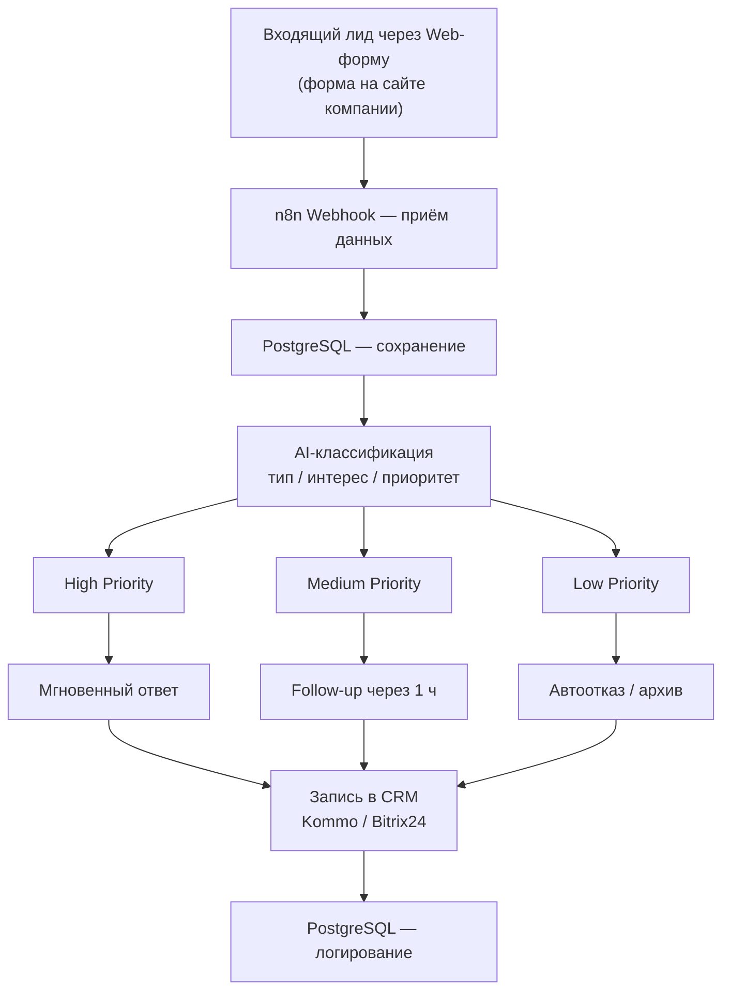
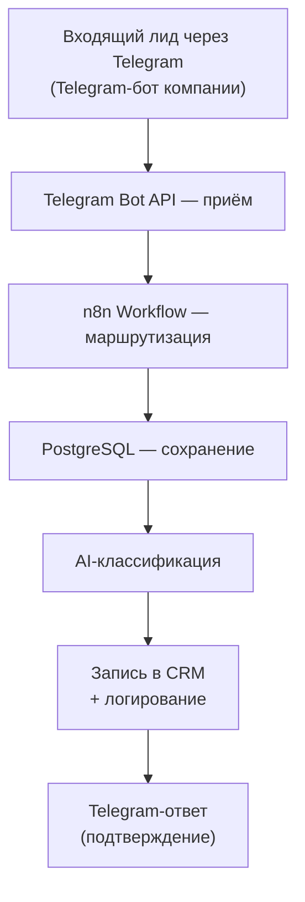
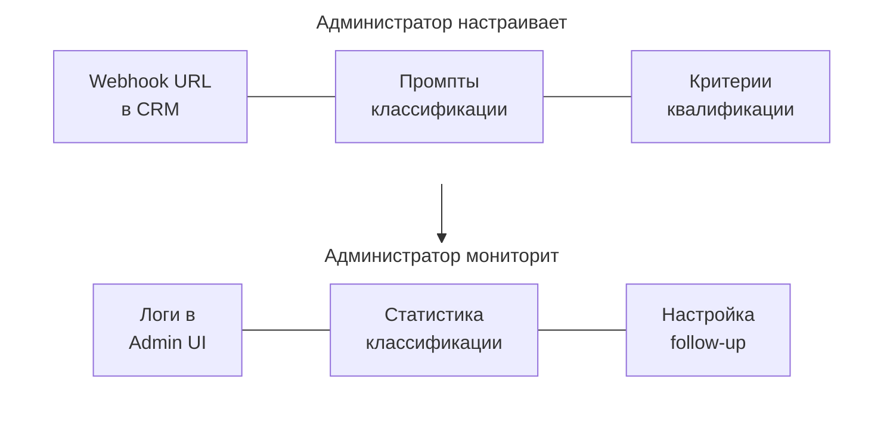
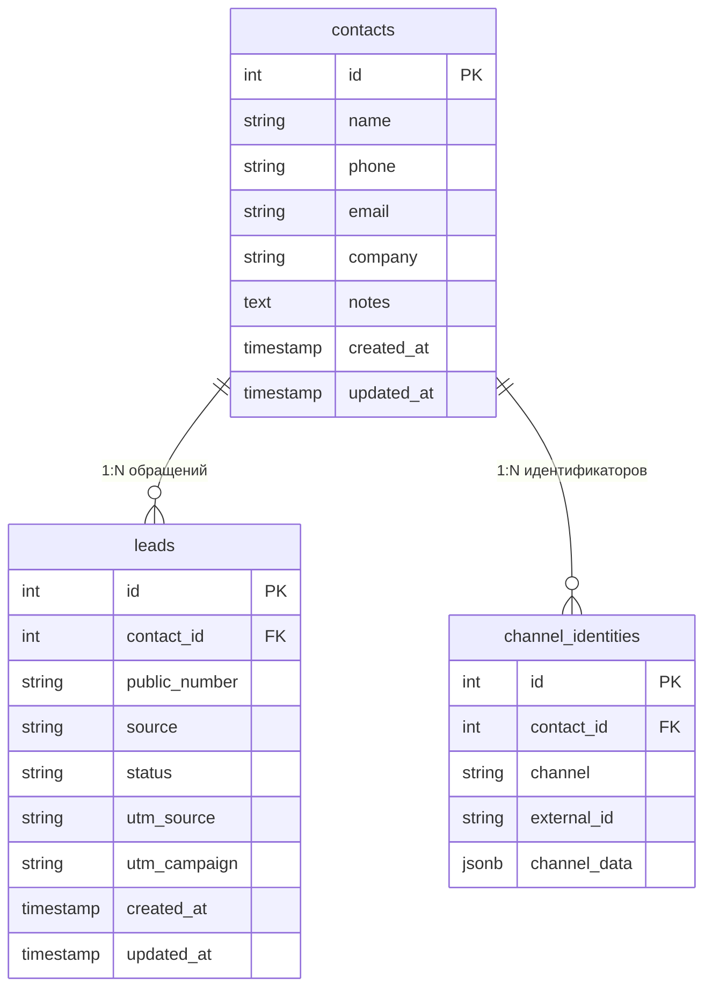
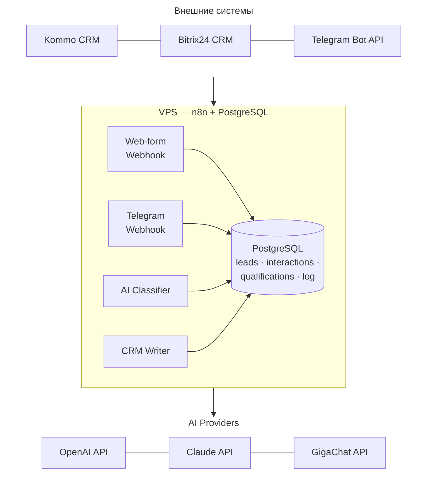
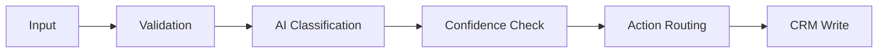
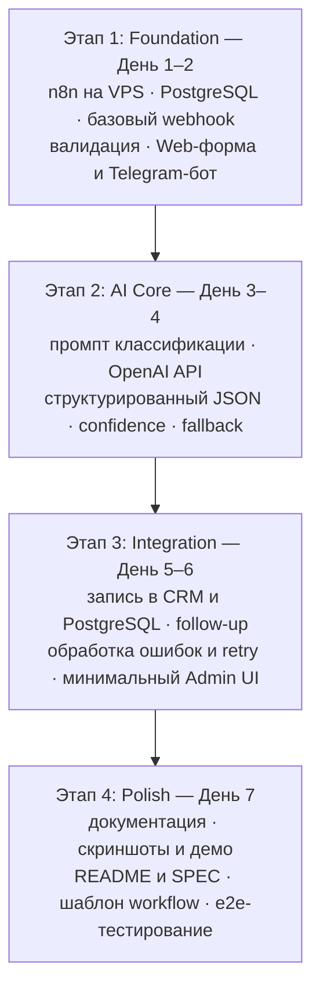
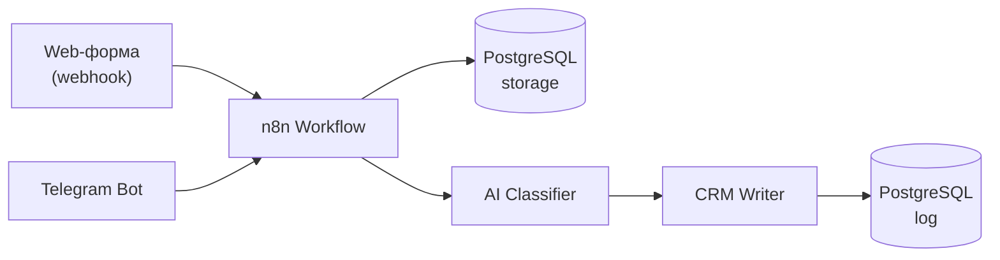

# 📘 Продуктовая спецификация (SPEC) — n8n Lead Qualification Assistant

**Версия:** 1.3
**Дата:** 2026-06-12
**Статус:** Approved
**Автор:** AI Automation Portfolio Lab

---

## 📑 Содержание

1. [Executive Summary](-1-executive-summary)
2. [Business Problem](-2-business-problem)
3. [Target Customers](-3-target-customers)
4. [Market Validation](-4-market-validation)
5. [Product Vision](-5-product-vision)
6. [MVP Scope](-6-mvp-scope)
7. [Out Of Scope](-7-out-of-scope)
8. [User Journey](-8-user-journey)
9. [Functional Requirements](-9-functional-requirements)
10. [Architecture Concept](-10-architecture-concept)
11. [Technology Stack](-11-technology-stack)
12. [Reuse Strategy](-12-reuse-strategy)
13. [Development Roadmap](-13-development-roadmap)
14. [Portfolio Value](-14-portfolio-value)
15. [Recommended MVP Architecture](-15-recommended-mvp-architecture)

---

## 📌 1. Executive Summary

**n8n Lead Qualification Assistant** — это автоматизированная система первичной квалификации входящих лидов, построенная на платформе n8n с интеграцией AI-классификации.

Кейс решает проблему ручной обработки обращений для малого и среднего бизнеса, обеспечивая 24/7 доступность, консистентную квалификацию и мгновенный отклик на входящие лиды.

**Ключевая ценность:**
- Автоматическая квалификация лидов без участия менеджера
- Интеграция с CRM (Kommo, Bitrix24)
- Гибкая AI-классификация под бизнес-логику заказчика
- Снижение времени отклика с часов до секунд

**Портфельная ценность:**
- Закрывает критический дефицит компетенций по n8n
- Создаёт базу для развития направления CRM-интеграций

---

## 🧩 2. Business Problem

### 2.1. Проблема заказчика

Компании, работающие с входящими лидами из мессенджеров и форм, сталкиваются с рядом проблем:

| Проблема | Последствия |
|----------|-------------|
| **Ручная обработка** | Менеджеры тратят время на первичный отсев |
| **Медленный отклик** | Потеря клиентов, которые уходят к конкурентам |
| **Неконсистентная квалификация** | Разные менеджеры по-разному оценивают лидов |
| **Отсутствие 24/7** | Ночные и выходные лиды остаются без внимания |
| **Нет стандартов** | Отсутствие единого критерия квалификации |

### 2.2. Типичные сценарии

**Сценарий 1: Такси-сервис (Перу)**
- Водители пишут в WhatsApp о желании подключиться
- Оператор вручную квалифицирует каждого
- Ночной поток лидов теряется

**Сценарий 2: Маркетплейс-продавец**
- Покупатели задают вопросы в чате WB/Ozon
- Менеджер отвечает вручную, задержки до нескольких часов
- Репутация страдает от медленного сервиса

**Сценарий 3: B2B компания**
- Лиды приходят через форму на сайте
- Менеджер распределяет вручную
- Высокая квалификация требует времени

### 2.3. Размер проблемы

По данным анализа рынка:
- Средний бюджет: 40 000–60 000 руб. за базовую настройку
- Типичный срок: 1–3 недели

---

## 🎯 3. Target Customers

### 3.1. Сегментация заказчиков

| Сегмент | Описание | Типичные потребности |
|---------|----------|----------------------|
| **Маркетплейс-продавцы** | Продавцы на WB/Ozon/ЯМ | Ответы на вопросы покупателей, обработка отзывов |
| **Такси-сервисы** | Компании по подключению водителей | Квалификация водителей, первичный контакт |
| **B2C сервисы** | Компании с входящими лидами из мессенджеров | Квалификация клиентов, запись на услугу |
| **B2B компании** | Компании с длинным циклом сделки | Первичная квалификация, распределение по менеджерам |

### 3.2. Портрет типового заказчика

**Профиль:**
- Малый или средний бизнес
- Использует CRM (Kommo, Bitrix24, AmoCRM)
- Получает лиды из мессенджеров или форм
- Есть потребность в AI-классификации, но нет in-house разработки
- Готов к интеграции через n8n/Zapier

**Боли:**
- Ручная обработка отнимает время
- Нужна скорость реакции
- Хотят автоматизировать, но без дорогой разработки

**Ожидания:**
- Настройка за 1–2 недели
- Бюджет до 60 000 руб.
- Интеграция с существующей CRM
- Понятная демонстрация

---

## 📊 4. Market Validation

Спрос на автоматизацию обработки входящих лидов подтверждается заказами на фриланс-площадках. Типовые требования заказов этого класса:

- приём обращений из мессенджеров и веб-форм;
- AI-классификация (тип, интерес, приоритет);
- интеграция с CRM (Kommo, Bitrix24);
- follow-up и уведомления менеджерам.

Ключевые инсайты:

1. **n8n + AI-классификация** — востребованное сочетание для обработки лидов
2. **Kommo CRM** — частое требование к интеграции
3. **Follow-up сценарии** — ожидаемая часть решения

---

## 🔭 5. Product Vision

### 5.1. Видение продукта

**n8n Lead Qualification Assistant** — это настраиваемый конструктор AI-квалификации лидов, который:

1. **Принимает лиды** из любого источника (CRM webhook, форма, мессенджер)
2. **Квалифицирует** с помощью AI по настраиваемым критериям
3. **Записывает результат** обратно в CRM
4. **Инициирует follow-up** по заданным сценариям

### 5.2. Дифференциация

| Аспект | Ручная обработка | Конкуренты | Наше решение |
|--------|------------------|------------|--------------|
| Скорость | Часы | Минуты | Секунды |
| 24/7 | Нет | Да | Да |
| Кастомизация | Нет | Ограниченная | Полная |
| Интеграция с CRM | Ручная | Частичная | Полная |
| AI-классификация | Нет | Базовая | Настраиваемая |

### 5.3. Принципы проектирования

1. **Modular first** — каждый компонент — отдельный workflow в n8n
2. **CRM-agnostic** — поддержка Kommo, Bitrix24, AmoCRM через абстракцию
3. **AI-provider-agnostic** — OpenAI, Claude, GigaChat по выбору
4. **Observable** — логирование всех операций для анализа
5. **Testable** — возможность тестирования без реальных лидов

---

## 📦 6. MVP Scope

### 6.1. Что входит в MVP

**MVP разделён на две фазы:**

#### Phase 1: Input Channels MVP (Current — Implemented ✅)

| Компонент | Описание | Приоритет | Статус |
|-----------|----------|-----------|--------|
| **Web-форма приём** | Приём входящих лидов через web-форму компании | P0 | ✅ Active |
| **Telegram Bot приём** | Приём входящих лидов через Telegram-бота | P0 | ✅ Active |
| **AI classifier** | Классификация по типу/интересу/приоритету | P0 | ✅ Active |
| **PostgreSQL storage** | Хранение лидов, обращений, результатов квалификации | P0 | ✅ Active |
| **Logger** | Логирование всех операций | P1 | ✅ Active |
| **Fallback Classification** | Резервная классификация при ошибках AI | P1 | ✅ Active |
| **Public Number** | Человекочитаемый номер обращения (LQ-NNNNNN) | Enhancement | ✅ Active |
| **Client UI** | Публичный UI для подачи обращений | Enhancement | ✅ Active |

#### Phase 2: Full MVP ✅ Complete

| Компонент | Описание | Приоритет | Статус |
|-----------|----------|-----------|--------|
| **CRM writer** | Запись квалифицированного лида в CRM | P0 | ✅ Active |
| **Follow-up trigger** | Инициация базового follow-up | P1 | ✅ Active |
| **Admin UI** | Dashboard, Lead Queue, Details | P2 | ✅ Active |

### 6.2. Обязательные элементы MVP

**Phase 1 (Input Channels):**
- ✅ Каналы поступления лидов: Web-форма + Telegram-бот
- ✅ Хранилище данных: PostgreSQL (Target Model v2)
- ✅ Оркестрация: n8n на VPS проекта
- ✅ Data Model v2: contacts, channel_identities, leads

**Phase 2 (Full MVP):**
- ✅ Интеграция CRM: Kommo
- ✅ Follow-up Automation (Initial Task Creation)
- ✅ Admin Console: Dashboard, Lead Queue, Lead Details

**Важно:** Full MVP полностью реализован. Phase 1 обеспечивала входные каналы, Phase 2 добавила интеграцию с CRM и Admin Console.

### 6.3. Критерии успеха MVP

#### Phase 1: Input Channels MVP ✅

- ✅ Лид проходит классификацию за < 5 секунд
- ✅ Точность классификации > 80% на тестовом наборе
- ✅ Развёртывание на VPS проекта
- ✅ Публичный UI доступен
- ✅ Telegram Bot работает 24/7
- ✅ Data Model v2 реализована (contacts, channel_identities)

#### Phase 2: Full MVP ✅

- ✅ Интеграция с CRM (Kommo)
- ✅ Follow-up автоматизация (Initial Task Creation)
- ✅ Admin Console (Dashboard, Lead Queue, Details)
- ✅ Демонстрационный сценарий включает полный путь: web/telegram → классификация → PostgreSQL → CRM

### 6.4. Критерии готовности кейс-стади

- README с описанием и скриншотами
- Демо-видео работы (2–3 минуты)
- Шаблон n8n workflow для публикации
- Документация по настройке
- Примеры промптов классификации

---

## 🚫 7. Out Of Scope

### 7.1. Сознательно исключено из MVP

| Функция | Причина исключения |
|---------|-------------------|
| **Интеграция с Asterisk** | Требует новых компетенций, отдельный кейс |
| **Голосовые платформы (TTS/STT)** | Высокая сложность, отдельный кейс |
| **API маркетплейсов (WB/Ozon)** | Требует отдельного проекта по интеграции |
| **Мультиагентные системы** | Высокая сложность, этап пост-MVP |
| **VoC-аналитика** | Аналитический модуль, отдельный кейс |
| **Комментарии в карточку лида** | Можно добавить в v2 |
| **A/B тестирование промптов** | Продвинутая функция, v2 |
| **Google Sheets как хранилище** | PostgreSQL выбран как основное хранилище MVP |
| **n8n.cloud как контур** | n8n разворачивается на VPS проекта |

### 7.2. Обоснование exclusions

**Принцип «MVP за 5–7 дней»:**

MVP Phase 1 реализован за 5-7 дней с имеющимися компетенциями. Phase 2 (CRM + Follow-up) добавила интеграция с CRM и Admin Console.

**Phase 1 (Input Channels MVP) — Реализован ✅**

Phase 1 включает:
- Web-форма приём
- Telegram Bot приём
- AI-классификация
- PostgreSQL Storage (Target Model v2)
- Logger
- Fallback Classification

**Phase 2 (Full MVP) — Реализован ✅**

Phase 2 включает:
- CRM-интеграцию (Kommo)
- Follow-up автоматизацию (Initial Task Creation)
- Admin Console (Dashboard, Lead Queue, Details)

**Обоснование разделения:**

CRM-интеграция была реализована в Phase 006-007:
- Kommo CRM интеграция — Phase 006
- Initial Task Creation — Phase 007
- Admin Console — Phase 008

---

## 🧭 8. User Journey

### 8.1. Путь лида — Web-форма (Happy Path)



### 8.2. Путь лида — Telegram (Happy Path)



### 8.3. Путь администратора



### 8.4. Путь заказчика (демонстрация)

**Обязательный демонстрационный сценарий:**

1. **Заказчик открывает демо-форму** или Telegram-бота
2. **Отправляет тестовое обращение** через web-форму или Telegram
3. **Наблюдает в реальном времени:**
   - Лид сохраняется в PostgreSQL
   - AI классифицирует (видно в логах)
   - Результат записывается в CRM
   - Follow-up отправляется (если применимо)
4. **Получает ссылку на логи и статистику**

---

## ⚙️ 9. Functional Requirements

### 9.1. FR-001: Web-форма Receiver

**Описание:** Приём входящих данных о лиде через web-форму компании.

**Требования:**
- Поддержка HTTP POST
- Валидация структуры входящих данных
- Сохранение в PostgreSQL
- Поддержка настраиваемых полей формы

**Критерии приёмки:**
- Web-форма корректно принимает данные
- Валидация отклоняет некорректные данные
- Логирование всех входящих запросов

### 9.2. FR-002: Telegram Bot Receiver

**Описание:** Приём входящих данных о лиде через Telegram-бота.

**Требования:**
- Интеграция с Telegram Bot API
- Обработка текстовых сообщений
- Сохранение в PostgreSQL
- Базовая обработка команд

**Критерии приёмки:**
- Бот корректно принимает сообщения
- Обработка команды /start
- Логирование всех входящих сообщений

### 9.3. FR-003: AI Classifier

**Описание:** Классификация лида по типу, интересу и приоритету с использованием AI.

**Требования:**
- Интеграция с OpenAI API / Claude API / GigaChat
- Настраиваемые промпты классификации
- Структурированный вывод (JSON)
- Обработка длинных сообщений
- Fallback при недоступности AI

**Выходные данные:**
```json
{
  "lead_type": "hot|warm|cold|spam",
  "interest": "high|medium|low",
  "priority": "high|medium|low",
  "category": "service_a|service_b|other",
  "summary": "Краткое описание обращения",
  "confidence": 0.85,
  "suggested_action": "call|email|archive|reject"
}
```

**Критерии приёмки:**
- Классификация выполняется за < 5 секунд
- Структурированный JSON на выходе
- Confidence score для каждого результата
- Обработка ошибок AI-провайдера

### 9.4. FR-004: CRM Writer

**Описание:** Запись результата классификации в CRM (Kommo или Bitrix24).

**Требования:**
- Обновление полей лида в CRM
- Создание примечания (note) с деталями классификации
- Обработка конфликтов (лид уже обработан)
- Retry при ошибках API

**Критерии приёмки:**
- Результат классификации записывается в CRM
- Примечание содержит summary и confidence
- Обработка ошибок с логированием

### 9.5. FR-005: PostgreSQL Storage

**Описание:** Постоянное хранение всех данных о лидах, обращениях и результатах квалификации.

**Требования:**
- Хранение лидов с полными данными
- Хранение истории обращений
- Хранение результатов квалификации
- Хранение истории обработки
- Хранение данных интеграции CRM

**Критерии приёмки:**
- Все лиды сохраняются в PostgreSQL
- История обращений доступна для анализа
- Данные интеграции CRM корректны

### 9.6. FR-006: Logger

**Описание:** Логирование всех операций для анализа и отладки.

**Требования:**
- Логирование всех входящих запросов
- Логирование AI-запросов и ответов
- Логирование CRM-операций
- Хранение в PostgreSQL

**Критерии приёмки:**
- Все операции логируются с timestamp
- Возможность фильтрации по дате/типу/статусу
- Экспорт логов в CSV/JSON

### 9.7. FR-007: Follow-up Trigger

**Описание:** Инициация follow-up действий на основе результата классификации.

**Требования:**
- Отправка сообщения в Telegram (подтверждение клиенту)
- Создание задачи для менеджера в CRM
- Таймер отложенных действий
- Шаблоны сообщений

**Критерии приёмки:**
- Follow-up отправляется в течение 1 минуты после классификации
- Шаблоны сообщений настраиваемые
- Задачи создаются в CRM

### 9.8. FR-008: Admin UI (Minimal)

**Описание:** Минимальный интерфейс для просмотра логов и настроек.

**Требования:**
- Просмотр последних логов
- Статистика классификации за период
- Редактирование промптов (опционально)

**Критерии приёмки:**
- Страница логов доступна через браузер
- Фильтрация по дате и типу
- Базовая статистика (количество лидов по типам)

---

## 🏛️ 10. Architecture Concept

### 10.0. Data Model v2 (Implemented ✅)

Проект использует **Target Data Model v2** (contact-centric):



UNIQUE(channel, external_id) — дедупликация идентификаторов канала.

**Ключевые особенности v2:**
- `contacts` — каноническая сущность человека/организации
- `channel_identities` — идентификаторы в каналах (telegram_user_id, email, phone)
- `leads` ссылается на `contacts` через `contact_id`
- Один контакт может иметь несколько обращений (leads)
- Дедупликация контактов по email/phone/telegram_id
- `public_number` — человекочитаемый номер (LQ-NNNNNN)

### 10.1. Высокая архитектура



### 10.2. Компоненты архитектуры

| Компонент | Технология | Назначение |
|-----------|------------|------------|
| **n8n Workflows** | n8n на VPS | Оркестрация всех процессов |
| **Web-form Webhook** | n8n Webhook node | Приём данных из web-формы |
| **Telegram Webhook** | n8n Telegram node | Приём сообщений из Telegram |
| **AI Classifier** | n8n HTTP Request node | Запрос к AI API |
| **PostgreSQL** | PostgreSQL на VPS | Основное хранилище данных |
| **CRM Writer** | n8n HTTP Request node | Запись в CRM API |
| **Follow-up Trigger** | n8n Switch node + HTTP | Логика follow-up |
| **Admin UI** | n8n native UI / простая веб-страница | Мониторинг |

### 10.3. Поток данных

```
1. Лид поступает через Web-форму или Telegram
2. n8n получает данные через Webhook
3. n8n сохраняет лид в PostgreSQL
4. n8n вызывает AI API с промптом классификации
5. AI возвращает структурированный JSON
6. n8n сохраняет результат квалификации в PostgreSQL
7. n8n записывает результат в CRM
8. n8n логирует операцию
9. n8n инициирует follow-up (если требуется)
```

---

## 🧰 11. Technology Stack

### 11.1. Основной стек MVP

| Слой | Технология | Обоснование |
|------|------------|-------------|
| **Оркестрация** | n8n на VPS | Полный контроль, соответствие требованию заказчиков |
| **AI Provider** | OpenAI / Claude / GigaChat | Выбор в зависимости от требований |
| **CRM Integration** | Kommo / Bitrix24 API | Востребованы на рынке |
| **Storage** | PostgreSQL | Основное постоянное хранилище MVP |
| **Hosting** | VPS проекта | Единый контур развёртывания |

### 11.2. Каналы поступления лидов

| Канал | Приоритет | Реализация |
|-------|-----------|------------|
| **Web-форма** | P0 (обязательно) | HTTP webhook из формы на сайте |
| **Telegram** | P0 (обязательно) | Telegram Bot API через n8n |

### 11.3. Альтернативы

| Компонент | Основной вариант | Альтернатива | Когда использовать |
|-----------|-----------------|--------------|---------------------|
| AI Provider | OpenAI | Claude, GigaChat | В зависимости от требований |
| CRM | Kommo | Bitrix24, AmoCRM | В зависимости от заказчика |

### 11.4. Зависимости

| Зависимость | Версия | Назначение |
|-------------|--------|------------|
| n8n | ≥ 1.0 | Основная платформа |
| PostgreSQL | ≥ 14 | Основное хранилище данных |
| Node.js | ≥ 18 | Runtime для n8n |
| VPS | — | Хостинг инфраструктуры |

---

## ♻️ 12. Reuse Strategy

### 12.1. Переиспользуемые архитектурные решения

| Решение | Применение в кейсе |
|---------|--------------------|
| **Мультипровайдерные AI-клиенты** | Единый интерфейс к LLM, смена провайдера без переписывания |
| **Pipeline классификации с confidence** | Оценка уверенности → маршрутизация действий |
| **Обработка ошибок и fallback** | Rule-based классификация при недоступности AI |
| **Методология структурированных промптов** | JSON-вывод, правила валидации ответа |

### 12.2. Pipeline обработки лида



---

## 🛣️ 13. Development Roadmap

### 13.1. Этапы реализации



### 13.2. Детализация по дням

| День | Задачи | Результат |
|------|--------|-----------|
| **День 1** | Развёртывание n8n на VPS, настройка PostgreSQL | Инфраструктура готова |
| **День 2** | Web-форма webhook, Telegram-бот, подключение CRM | Лиды попадают в систему из двух каналов |
| **День 3** | Промпт классификации, интеграция с AI | AI классифицирует тестовые лиды |
| **День 4** | Confidence scoring, fallback, обработка ошибок | Надёжная классификация с fallback |
| **День 5** | Запись в CRM, запись в PostgreSQL, обработка ошибок | Результат пишется в CRM и БД |
| **День 6** | Follow-up, Admin UI | Базовый follow-up работает |
| **День 7** | Документация, демо, полировка | Готовый кейс-стади |

### 13.3. Риски и митигация

| Риск | Вероятность | Влияние | Митигация |
|------|-------------|---------|-----------|
| **API CRM недоступен** | Низкая | Высокое | Mock-данные для разработки, retry-логика |
| **AI даёт неточные результаты** | Средняя | Высокое | Итерация промптов, тестовый набор |
| **VPS конфигурация** | Средняя | Среднее | Документация по развёртыванию, backup |
| **Сложность интеграции Kommo** | Средняя | Среднее | Начать с Bitrix24 (лучше документирован) |

---

## 💼 14. Portfolio Value

### 14.1. Дефициты портфолио, которые закрывает кейс

| Дефицит | Покрытие | Обоснование |
|---------|----------|-------------|
| **n8n** | ✅ Полное | Кейс демонстрирует реальный workflow на n8n |
| **CRM-интеграции** | ⚠️ Частичное | Kommo или Bitrix24, расширяемо |
| **AI-классификация лидов** | ✅ Полное | Core-value кейса |
| **Автоматизация обработки лидов** | ✅ Полное | End-to-end решение |

### 14.2. Коммерческая ценность

| Аспект | Ценность |
|--------|----------|
| **Востребованный стек** | n8n, AI-классификация и Kommo — типовые требования заказов |
| **Демонстрационный кейс** | Конкретный workflow для показа заказчику |
| **Шаблон для кастомизации** | Базовая архитектура для быстрых проектов |
| **Компетенция интеграции CRM** | Базовый опыт с Kommo/Bitrix24 |

---

## 🏗️ 15. Recommended MVP Architecture

### 15.1. Конкретная первая реализация

**Цель:** Создать демонстрационный портфельный кейс за 5–7 дней.

**Ограничения:**
- Не писать код — использовать n8n workflows
- Не разворачивать сложную инфраструктуру — VPS-контур проекта
- Не интегрировать всё — одна CRM, один AI-провайдер
- Не делать enterprise — минимальный рабочий прототип

### 15.2. Рекомендуемый стек для MVP

| Компонент | Выбор | Обоснование |
|-----------|-------|-------------|
| **Оркестрация** | n8n на VPS | Полный контроль, единый контур проекта |
| **AI Provider** | OpenAI GPT-4o-mini | Оптимальное соотношение цена/качество |
| **CRM** | Kommo или Bitrix24 | Востребованы в заказах |
| **Storage** | PostgreSQL | Основное постоянное хранилище MVP |
| **Follow-up** | Telegram Bot | Популярный канал уведомлений клиентов |

### 15.3. Каналы поступления лидов

| Канал | Приоритет | Обязательность |
|-------|-----------|----------------|
| **Web-форма** | P0 | Обязательно |
| **Telegram** | P0 | Обязательно |

### 15.4. Workflow MVP



### 15.5. Промпт для MVP

```markdown
Ты — AI-классификатор входящих лидов. Проанализируй обращение клиента и классифицируй его.

Обращение клиента:
{{lead_message}}

Контекст:
{{lead_context}}

Верни результат в формате JSON:
{
  "lead_type": "hot|warm|cold|spam",
  "interest": "high|medium|low",
  "priority": "high|medium|low",
  "summary": "Краткое описание обращения на русском языке",
  "confidence": 0.85,
  "suggested_action": "call|email|archive|reject",
  "reasoning": "Краткое обоснование классификации"
}

Правила:
1. hot — клиент готов купить/подключиться прямо сейчас
2. warm — клиент заинтересован, но требует follow-up
3. cold — клиент сомневается, требует времени
4. spam — нецелевое обращение, реклама, спам
```

### 15.6. Демо-сценарий

**Обязательный демонстрационный сценарий:**

Демонстрация должна показывать полный путь лида:
- Web-форма или Telegram → входящий лид
- PostgreSQL → сохранение
- AI-классификация → результат
- CRM → запись квалифицированного лида

**Настройка (2–3 часа):**

1. Развернуть n8n на VPS проекта
2. Настроить PostgreSQL для хранения данных
3. Создать web-форму для приёма лидов
4. Настроить Telegram-бота
5. Настроить интеграцию с CRM (Kommo или Bitrix24)
6. Настроить AI-классификатор

**Демонстрация (5 минут):**

1. Заказчик открывает web-форму или Telegram-бота
2. Отправляет тестовое обращение
3. Наблюдает в реальном времени:
   - Лид сохраняется в PostgreSQL
   - AI классифицирует (видно в логах)
   - Результат записывается в CRM
   - Follow-up отправляется (если применимо)
4. Видит результат классификации в полях лида в CRM

### 15.7. Файловая структура кейса

Актуальная структура репозитория ведётся в одном месте — [PROJECT_STRUCTURE.md](PROJECT_STRUCTURE.md) (древовидный план эпохи составления SPEC в этом документе не поддерживается во избежание расхождений с фактом).

### 15.8. Критерии готовности

#### Phase 1: Input Channels MVP ✅

| Критерий | Статус |
|----------|--------|
| n8n развёрнут на VPS | ✅ Готово |
| PostgreSQL настроена и хранит данные | ✅ Готово (Data Model v2) |
| Web-форма приём лидов работает | ✅ Готово |
| Telegram-бот приём лидов работает | ✅ Готово |
| AI-классификация работает | ✅ Готово |
| Демонстрационный сценарий готов | ✅ Готово (Input Channels) |
| README оформлен | ✅ Готово |
| SPEC завершён | ✅ Готово |

#### Phase 2: Full MVP ✅

| Критерий | Статус |
|----------|--------|
| CRM-интеграция работает | ✅ Готово (Kommo) |
| Follow-up автоматизация работает | ✅ Готово (Initial Task Creation) |
| Admin Console работает | ✅ Готово (Dashboard, Queue, Details) |
| Полный демо-сценарий (Web → AI → CRM) | ✅ Готово |

---

**Конец спецификации**

*Спецификация разработана в рамках AI Automation Portfolio Lab*
*Дата: 2026-06-12*