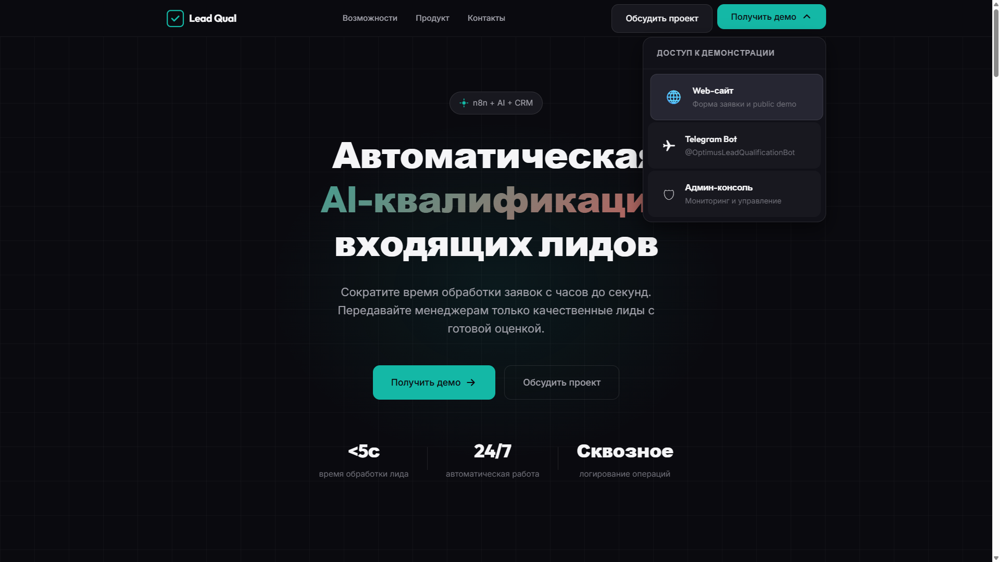

# Демонстрация системы

Этот документ показывает полный путь лида через систему — от обращения клиента до работы менеджера и контроля руководителя.

---

## Общая схема процесса


Система реализует полный цикл обработки обращений:

```
Клиент → Заявка → Автоматическая обработка → AI → CRM → Менеджер → Контроль
```

---

## Точка входа в демо-контур

**Demo Landing:** https://lead-qual-demo.alex-n8n.site

Demo Landing — центральная точка входа в демонстрационный контур системы.



Нажмите **«Получить демо»** и выберите канал:

| Канал | Описание |
|-------|----------|
| **Web-сайт** | Форма заявки и public demo |
| **Telegram Bot** | @OptimusLeadQualificationBot |
| **Админ-консоль** | Мониторинг и управление |

---

## Шаг 1. Поступление обращения

Клиент может оставить заявку через два канала: Website или Telegram.

### Вариант 1: Website


Клиент заполняет форму на сайте:

1. Указывает имя, телефон, сообщение
2. Отправляет форму
3. Получает подтверждение с номером заявки (LQ-XXXXXX)
4. Заявка автоматически поступает в систему

---

### Вариант 2: Telegram


Клиент пишет боту в Telegram:

1. Отправляет сообщение
2. Бот подтверждает приём
3. Показывает результат классификации
4. Заявка автоматически поступает в систему

---

## Шаг 2. Автоматическая обработка

Три n8n workflow обрабатывают обращение последовательно.

### Workflow 1: Lead Ingestion


**Что делает:**

- Принимает webhook из Website или Telegram
- Валидирует данные
- Создаёт/находит контакт в базе
- Сохраняет лид в PostgreSQL
- Триггерит классификацию

---

### Workflow 2: AI Classification


**Что делает:**

- Извлекает необработанный лид из базы
- Отправляет в OpenAI для классификации
- При ошибке — использует rule-based fallback
- Сохраняет результат квалификации
- Триггерит CRM Writer

**Классификация:**

| Тип | Описание | Действие |
|-----|----------|----------|
| **Hot** | Готов купить сейчас | Звонок через 15 мин |
| **Warm** | Заинтересован | Follow-up через 24 ч |
| **Cold** | Думает | Follow-up через 7 дней |
| **Spam** | Нецелевой | Отклонить |

---

### Workflow 3: Kommo Writer


**Что делает:**

- Готовит payload для Kommo API
- Создаёт сделку в CRM
- Устанавливает статус воронки по типу лида
- Создаёт задачу менеджеру
- Сохраняет ID сделки в PostgreSQL

---

## Шаг 3. Интеграция с CRM

Результат автоматически попадает в Kommo.

### Список сделок


Все лиды отображаются в воронке продаж:

- Автоматическое создание сделки
- Правильный статус воронки
- Все данные клиента переданы

---

### Горячий лид в CRM


Сделка типа Hot:

- Статус: Hot Lead
- Задача менеджеру: через 15 минут
- Все данные классификации в примечании

---

## Шаг 4. Работа менеджера

Менеджер работает с лидами через Admin Console.

### Очередь горячих лидов


Менеджер видит:

- Номер заявки (LQ-XXXXXX)
- Имя клиента
- Тип и приоритет
- Confidence score
- Источник (Website / Telegram)
- Статус в CRM

---

## Шаг 5. Контроль руководителя

Руководитель контролирует процесс через Dashboard.

### Dashboard: Обзор системы


Dashboard показывает:

- **Всего лидов** — общее количество обращений
- **Распределение по типам** — hot/warm/cold/spam
- **CRM синхронизация** — статус интеграции
- **История** — последние обращения

---

## Итог полного цикла

### Что получает бизнес

**Клиент:**
- Мгновенное подтверждение заявки
- Быстрая реакция (горячие лиды — звонок через 15 минут)

**Менеджер:**
- Готовые лиды с классификацией
- Приоритизированная очередь
- Все данные в CRM

**Руководитель:**
- Прозрачность процесса
- Метрики в реальном времени
- Контроль качества

---

## Связанные документы

- [README.md](../README.md) — главное введение в проект
- [BUSINESS_VALUE.md](BUSINESS_VALUE.md) — ценность для бизнеса
- [USER_GUIDE.md](USER_GUIDE.md) — руководство пользователя
- [E2E_SCENARIOS.md](E2E_SCENARIOS.md) — сквозные сценарии
- [AI_QUALIFICATION.md](AI_QUALIFICATION.md) — логика AI-классификации