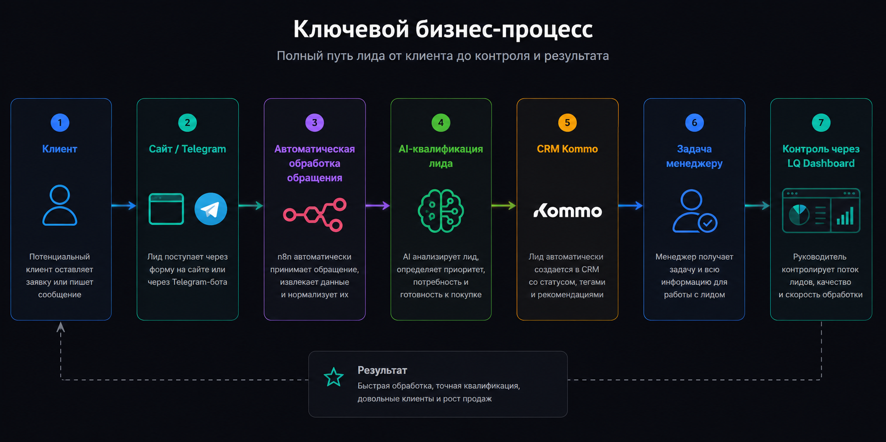
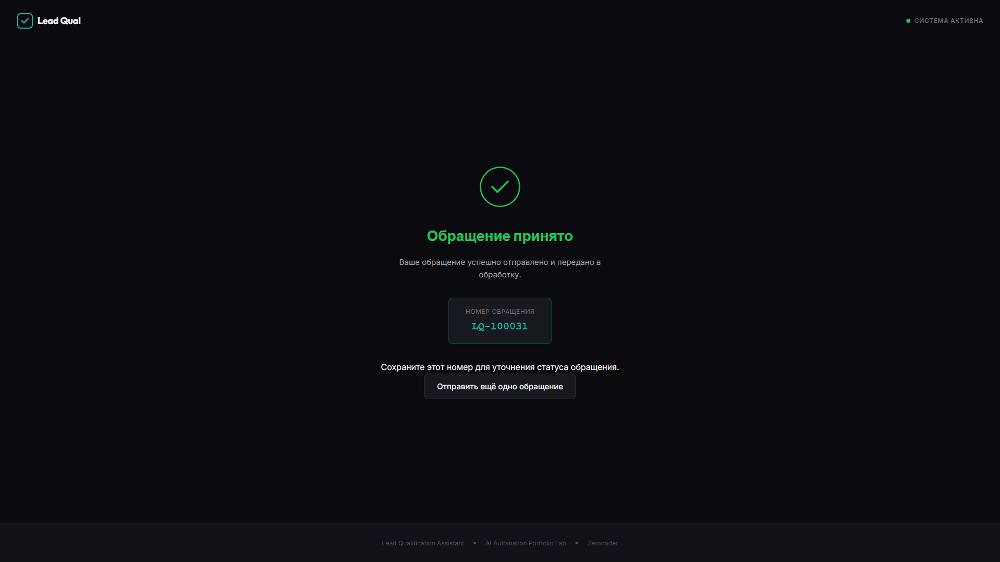
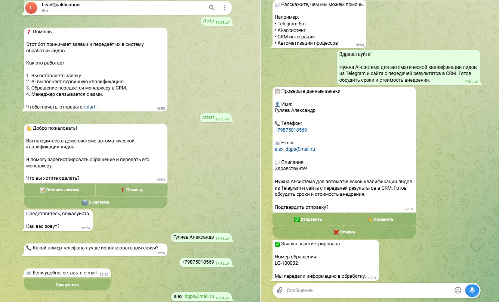
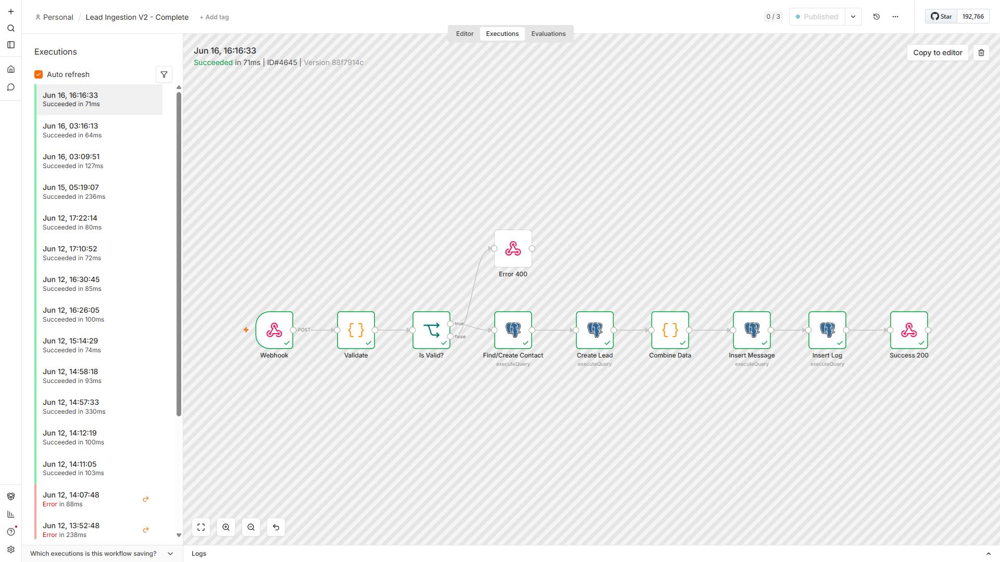
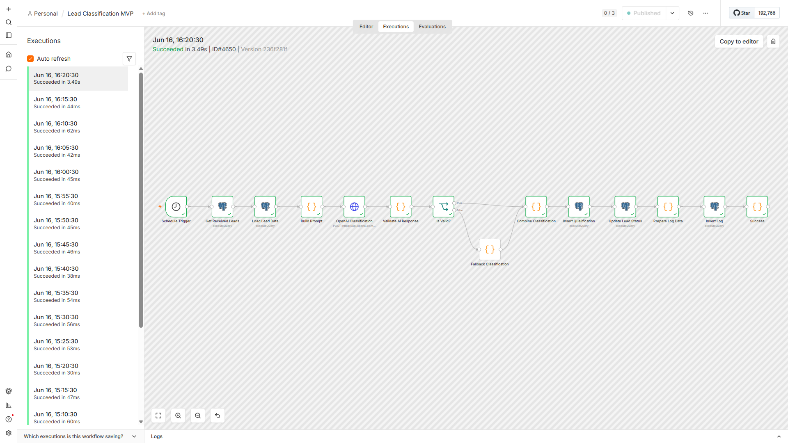
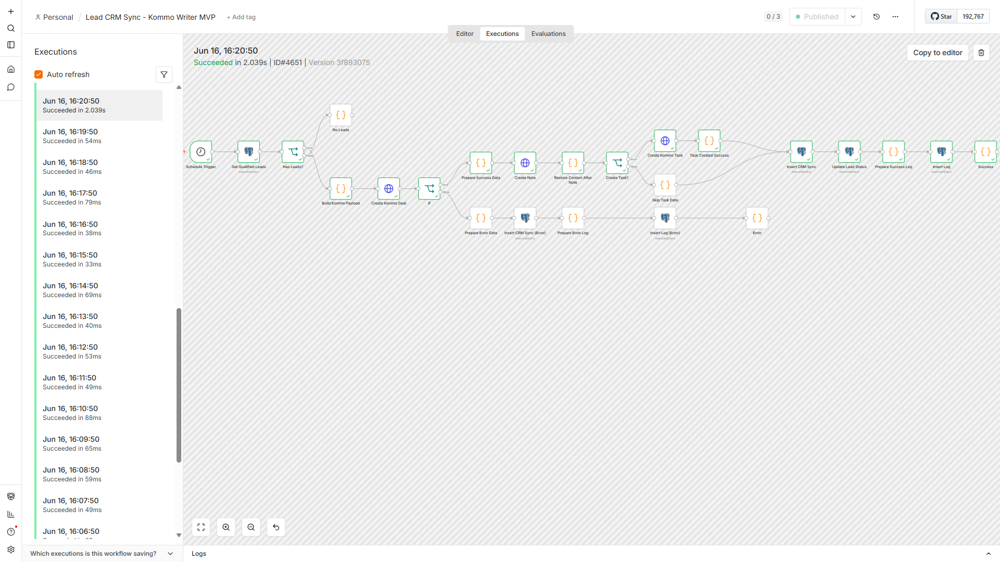
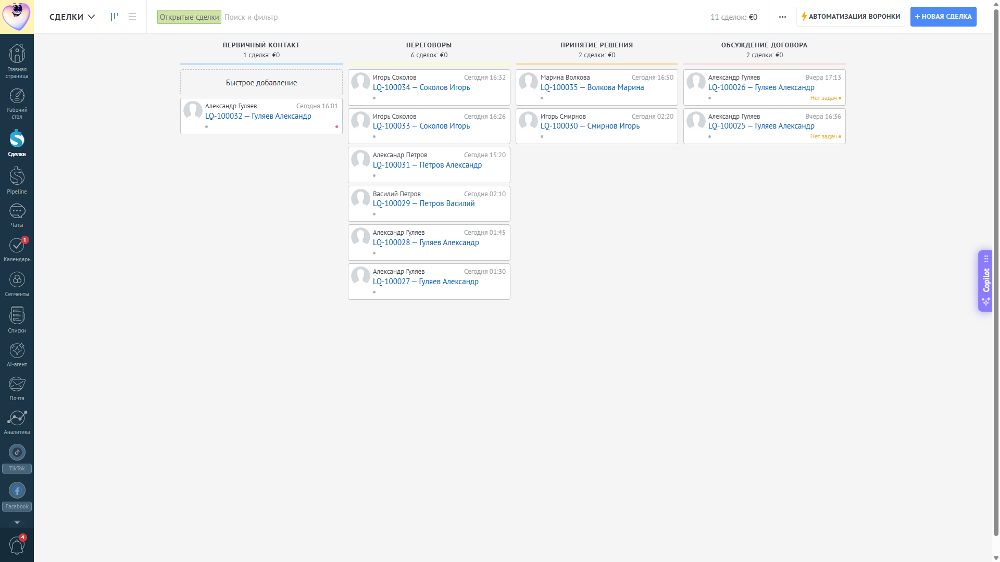
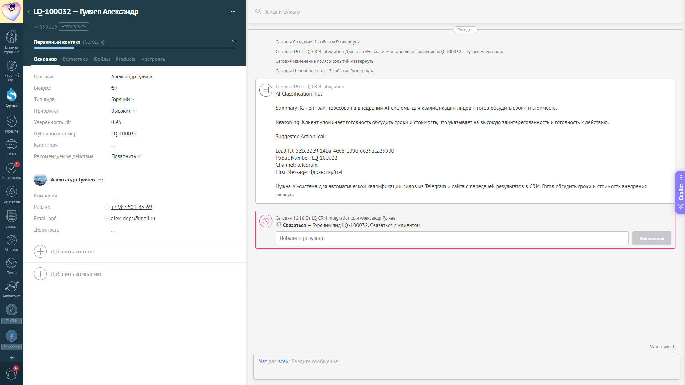
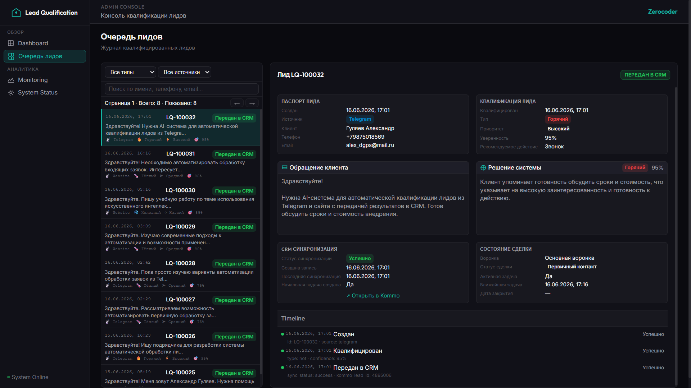
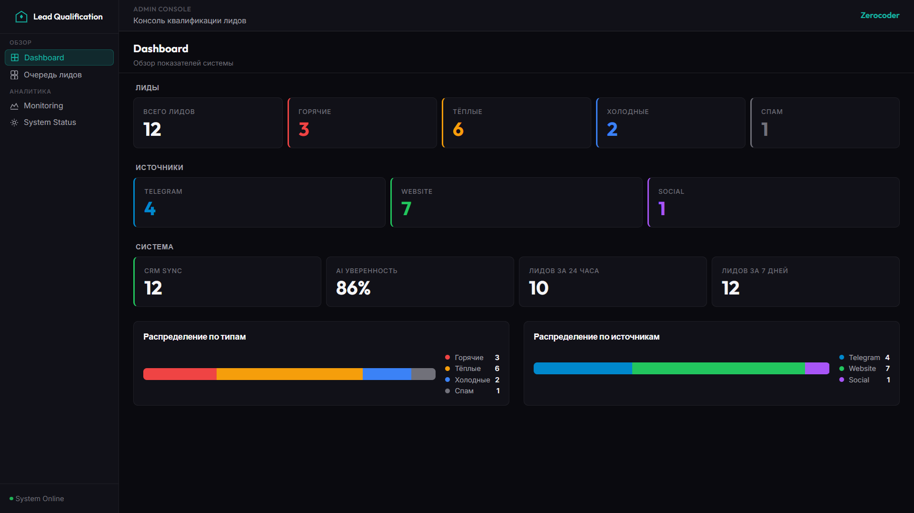

# 🎬 Демонстрация системы Lead Qualification MVP

**Дата:** 2026-09-15
**Статус:** Скриншот-тур полного пути лида: Website/Telegram → AI-классификация → Kommo → менеджер → контроль руководителя.

Этот документ показывает полный путь лида через систему — от обращения клиента до работы менеджера и контроля руководителя.

---

## 🗺️ 1. Общая схема процесса



Система реализует полный цикл обработки обращений:

```
Клиент → Заявка → Автоматическая обработка → AI → CRM → Менеджер → Контроль
```

---

## 🚪 2. Точка входа в демо-контур

Демонстрационный контур доступен по трём каналам:

| Канал | Адрес |
|-------|-------|
| **Web-форма обращения** | https://lead-qual.alex-n8n.site |
| **Telegram Bot** | @OptimusLeadQualificationBot |
| **Админ-консоль** | https://lead-qual-admin.alex-n8n.site (демо-режим — только просмотр) |

Продуктовый лендинг кейса: https://lead-qual-demo.alex-n8n.site.

---

## 📥 Шаг 1. Поступление обращения

Клиент может оставить заявку через два канала: Website или Telegram.

### Вариант 1: Website



Клиент заполняет форму на сайте:

1. Указывает имя и телефон или e-mail
2. Описывает запрос и выбирает источник знакомства
3. Отправляет форму
4. Получает подтверждение с номером обращения (LQ-XXXXXX)
5. Заявка автоматически поступает в систему

---

### Вариант 2: Telegram



Клиент пишет боту в Telegram:

1. Отправляет сообщение
2. Бот подтверждает приём
3. Показывает результат классификации
4. Заявка автоматически поступает в систему

---

## ⚙️ Шаг 2. Автоматическая обработка

Три n8n workflow обрабатывают обращение последовательно.

### Workflow 1: Lead Ingestion



**Что делает:**

- Принимает webhook из Website или Telegram
- Валидирует данные
- Создаёт/находит контакт в базе
- Сохраняет лид в PostgreSQL
- Триггерит классификацию

---

### Workflow 2: AI Classification



**Что делает:**

- Извлекает необработанный лид из базы
- Отправляет в OpenAI для классификации
- При ошибке — использует rule-based fallback
- Сохраняет результат квалификации
- Триггерит CRM Writer

**Классификация:**

| Тип | Описание | Действие |
|-----|----------|----------|
| **Hot** | Готов купить сейчас | Звонок через 15 мин |
| **Warm** | Заинтересован | Follow-up через 24 ч |
| **Cold** | Думает | Follow-up через 7 дней |
| **Spam** | Нецелевой | Отклонить |

---

### Workflow 3: Kommo Writer



**Что делает:**

- Готовит payload для Kommo API
- Создаёт сделку в CRM
- Устанавливает статус воронки по типу лида
- Создаёт задачу менеджеру
- Сохраняет ID сделки в PostgreSQL

---

## 🔗 Шаг 3. Интеграция с CRM

Результат автоматически попадает в Kommo.

### Список сделок



Все лиды отображаются в воронке продаж:

- Автоматическое создание сделки
- Правильный статус воронки
- Все данные клиента переданы

---

### Горячий лид в CRM



Сделка типа Hot:

- Статус: Первичный контакт (по lead_type=hot; имена статусов настраиваются через env)
- Задача менеджеру: через 15 минут
- Приоритет в поле сделки, все данные классификации в примечании

---

## 👤 Шаг 4. Работа менеджера

Менеджер работает с лидами через Admin Console.

### Очередь горячих лидов



Менеджер видит:

- Номер заявки (LQ-XXXXXX)
- Имя клиента
- Тип и приоритет
- Confidence score
- Источник (Website / Telegram)
- Статус в CRM

---

## 👁️ Шаг 5. Контроль руководителя

Руководитель контролирует процесс через Dashboard.

### Dashboard: Обзор системы



Dashboard показывает:

- **Всего лидов** — общее количество обращений
- **Распределение по типам** — hot/warm/cold/spam
- **CRM синхронизация** — статус интеграции
- **История** — последние обращения

---

## ✅ 8. Итог полного цикла

### Что получает бизнес

**Клиент:**
- Мгновенное подтверждение заявки
- Быстрая реакция (горячие лиды — звонок через 15 минут)

**Менеджер:**
- Готовые лиды с классификацией
- Приоритизированная очередь
- Все данные в CRM

**Руководитель:**
- Прозрачность процесса
- Метрики в реальном времени
- Контроль качества

---

## 🔗 9. Связанные документы

- [README.md](../README.md) — главное введение в проект
- [BUSINESS_VALUE.md](BUSINESS_VALUE.md) — ценность для бизнеса
- [USER_GUIDE.md](USER_GUIDE.md) — руководство пользователя
- [E2E_SCENARIOS.md](E2E_SCENARIOS.md) — сквозные сценарии
- [AI_QUALIFICATION.md](AI_QUALIFICATION.md) — логика AI-классификации