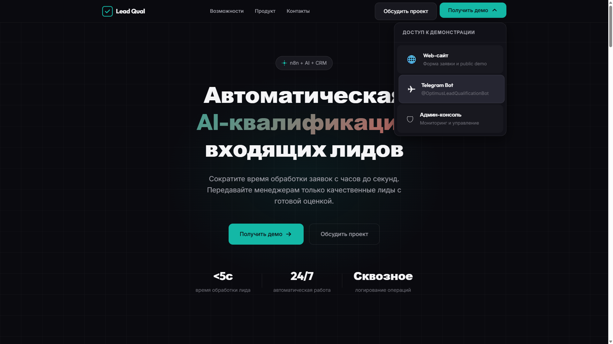

# Руководство клиента

Это руководство для клиентов, которые хотят оставить заявку через систему Lead Qualification.

---

## Что такое Lead Qualification

Lead Qualification — система приёма и обработки обращений. Вы оставляете заявку через Website или Telegram, система регистрирует её и передаёт менеджеру.

---

## Website: как оставить заявку

### Шаг 1. Войти через лендинг

Откройте лендинг: https://lead-qual-demo.alex-n8n.site

Нажмите кнопку **«Получить демо»** и выберите **«Web-сайт»**.


Вы перейдёте на форму заявки.

---

### Шаг 2. Открыть форму

Вы увидите форму заявки.


---

### Шаг 3. Заполнить поля

| Поле | Обязательно | Пример |
|------|-------------|--------|
| **Имя** | Да | Александр Петров |
| **Телефон** | Да* | +7(495)123-45-67 |
| **Email** | Да* | a.petrov@example.com |
| **Сообщение** | Да | Хочу узнать о ваших услугах |

\* Достаточно заполнить телефон ИЛИ email.


**Валидация:**
- Сообщение минимум 10 символов
- Телефон или Email обязателен

---

### Шаг 4. Отправить заявку

Нажмите кнопку «Отправить».

Система покажет статус обработки:


---

### Шаг 5. Подтверждение

После успешной отправки вы увидите:


> ✅ Обращение принято
>
> Ваше обращение успешно отправлено и передано в обработку.
>
> Номер обращения: **LQ-100031**
>
> Мы свяжемся с вами в ближайшее время.

---

## Telegram: как оставить заявку

### Шаг 1. Войти через лендинг

Откройте лендинг: https://lead-qual-demo.alex-n8n.site

Нажмите кнопку **«Получить демо»** и выберите **«Telegram Bot»**.



Вы перейдёте к боту в Telegram.

---

### Шаг 2. Начать диалог

Отправьте команду:

```
/start
```

Бот ответит:

> 👋 Добро пожаловать!
>
> Вы находитесь в демо-системе автоматической квалификации лидов.
>
> Я помогу зарегистрировать обращение и передать его менеджеру.
>
> Что вы хотите сделать?
>
> 📝 Оставить заявку | ❓ Помощь
> ℹ️ О системе

---

### Шаг 3. Нажать «Оставить заявку»

Нажмите inline-кнопку **«📝 Оставить заявку»**.


---

### Шаг 4. Ввести данные

Бот запросит данные по шагам:

**Шаг 4.1. Имя**

> Представьтесь, пожалуйста.
>
> Как вас зовут?

Введите ваше имя.

---

**Шаг 4.2. Телефон**

> 📞 Какой номер телефона лучше использовать для связи?

Введите номер телефона.

---

**Шаг 4.3. Email**

> 📧 Если удобно, оставьте e-email.
>
> [Пропустить]

Введите email или нажмите **«Пропустить»**.

---

**Шаг 4.4. Сообщение**

> 💬 Расскажите, чем мы можем помочь.
>
> Например:
> • Telegram-бот
> • AI-ассистент
> • CRM-интеграция
> • Автоматизация процессов

Опишите ваш запрос.

---

**Шаг 4.5. Подтверждение**

Бот покажет сводку введённых данных:

> Проверьте данные:
>
> **Имя:** Александр Гуляев
> **Телефон:** +79875018569
> **Email:** alex_dgps@mail.ru
> **Сообщение:** Здравствуйте! Нужна AI-система для автоматической квалификации лидов из Telegram и сайта с передачей результатов в CRM. Готов обсудить сроки и стоимость внедрения.
>
> ✅ Отправить | ✏️ Изменить | ❌ Отмена

Нажмите **«✅ Отправить»** для отправки.

---

### Шаг 5. Регистрация заявки

После подтверждения бот ответит:

> ✅ Заявка зарегистрирована
>
> Номер обращения: **LQ-000132**
>
> Мы передали информацию в обработку.

---

## Команды Telegram-бота

| Команда | Описание |
|---------|----------|
| `/start` | Главное меню |
| `/help` | Справка по работе бота |
| `/about` | Информация о проекте |

---

## После отправки заявки

### Что происходит с вашей заявкой

1. **Регистрация** — заявка получает номер (LQ-XXXXXX)
2. **Обработка** — система анализирует обращение
3. **Передача менеджеру** — менеджер получает уведомление
4. **Контакт** — менеджер свяжется с вами

### Когда ответят

Время ответа зависит от типа заявки:

- **Горячие заявки** — до 15 минут
- **Тёплые заявки** — до 24 часов
- **Холодные заявки** — до 7 дней

---

## FAQ клиента

### Через сколько ответят?

Горячие заявки — до 15 минут, тёплые — до 24 часов.

---

### Можно оставить заявку через Telegram?

Да. Найдите бота и отправьте `/start`, затем следуйте инструкциям.

---

### Какие данные нужны для заявки?

Обязательно: имя и сообщение.
Телефон или Email — хотя бы одно из двух.

---

### Что если я ошибся в данных?

Если заявка уже отправлена — сообщите менеджеру номер заявки при контакте, он исправит данные.

---

## Связанные документы

- [BUSINESS_VALUE.md](BUSINESS_VALUE.md) — ценность для бизнеса
- [SYSTEM_DEMO.md](SYSTEM_DEMO.md) — демонстрация системы
- [E2E_SCENARIOS.md](E2E_SCENARIOS.md) — сквозные сценарии