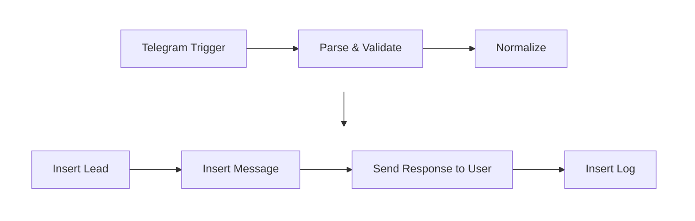

# 🤖 Telegram Input Channel — Implementation

**Дата:** 2026-09-15
**Статус:** Подготовка Telegram-канала приёма: конфигурация бота, workflow, чеклист активации.

## 📍 1. Status

**✅ Implemented** — Telegram Bot is active and operational.

This document describes the Telegram integration architecture and configuration.

---

## 🔧 2. Bot Configuration

The Telegram Bot is configured via environment variable:

```bash
# Telegram Bot Configuration
TELEGRAM_BOT_TOKEN=your_telegram_bot_token_here
```

### Bot Username

**@OptimusLeadQualificationBot**

---

## ⚙️ 3. Telegram Workflow

### Workflow: Lead Ingestion - Telegram

**Trigger:** Telegram Trigger node (polls for updates)

**Flow:**



### Input Contract (from Telegram API)

```json
{
  "update_id": 123456789,
  "message": {
    "message_id": 1,
    "from": {
      "id": 123456789,
      "is_bot": false,
      "first_name": "Иван",
      "last_name": "Петров",
      "username": "ivan_petrov",
      "language_code": "ru"
    },
    "chat": {
      "id": 123456789,
      "first_name": "Иван",
      "last_name": "Петров",
      "username": "ivan_petrov",
      "type": "private"
    },
    "date": 1718012400,
    "text": "Хочу узнать подробнее о ваших услугах"
  }
}
```

### Normalization Logic

| Telegram Field | Lead Field | Notes |
|----------------|------------|-------|
| `message.from.id` | `external_id` | Telegram user ID |
| `message.from.first_name` + `last_name` | `name` | Concatenated |
| `message.from.username` | - | Can be stored in metadata |
| `message.chat.id` | - | For replies |
| `message.text` | `messages.content` | Message text |
| - | `source` | Set to `"telegram"` |
| - | `phone` | Not available from Telegram |
| - | `email` | Not available from Telegram |

### Response to User

```json
{
  "chat_id": 123456789,
  "text": "✅ Спасибо за обращение! Ваша заявка принята.\n\nМы свяжемся с вами в ближайшее время.",
  "parse_mode": "HTML"
}
```

---

## 📋 4. n8n Workflow Definition (Template)

**File:** `workflow/n8n/workflows/lead-ingestion-telegram.json`

```json
{
  "name": "Lead Ingestion - Telegram",
  "nodes": [
    {
      "parameters": {
        "updates": ["message"]
      },
      "name": "Telegram Trigger",
      "type": "n8n-nodes-base.telegramTrigger",
      "typeVersion": 1,
      "position": [250, 300],
      "credentials": {
        "telegramApi": {
          "id": "telegram-bot-credentials",
          "name": "Telegram Bot"
        }
      }
    },
    {
      "parameters": {
        "jsCode": "// Parse Telegram update\nconst update = $input.item.json;\n\nif (!update.message || !update.message.text) {\n  return { json: { valid: false, error: 'No message text' } };\n}\n\nconst message = update.message;\nconst from = message.from || {};\n\nconst lead = {\n  name: `${from.first_name || ''} ${from.last_name || ''}`.trim(),\n  external_id: from.id ? String(from.id) : null,\n  source: 'telegram',\n  message: message.text\n};\n\n// Validate\nif (lead.message.length < 10) {\n  return { json: { valid: false, error: 'Message too short' } };\n}\n\nreturn { json: { valid: true, lead } };"
      },
      "name": "Parse & Validate",
      "type": "n8n-nodes-base.code",
      "typeVersion": 2,
      "position": [470, 300]
    },
    {
      "parameters": {
        "chatId": "={{ $json.message.chat.id }}",
        "text": "✅ Спасибо за обращение! Ваша заявка принята.\\n\\nМы свяжемся с вами в ближайшее время.",
        "additionalFields": {}
      },
      "name": "Send Response",
      "type": "n8n-nodes-base.telegram",
      "typeVersion": 1,
      "position": [1350, 300],
      "credentials": {
        "telegramApi": {
          "id": "telegram-bot-credentials",
          "name": "Telegram Bot"
        }
      }
    }
  ],
  "connections": {
    "Telegram Trigger": {
      "main": [["Parse & Validate"]]
    }
  }
}
```

---

## ✅ 5. Activation Checklist

When `TELEGRAM_BOT_TOKEN` is available:

1. **Add token to `.env`**
   ```bash
   TELEGRAM_BOT_TOKEN=your_token_here
   ```

2. **Restart n8n**
   ```bash
   docker compose restart n8n
   ```

3. **Create Telegram credentials in n8n**
   - Navigate to Settings → Credentials
   - Create new "Telegram API" credential
   - Enter the bot token

4. **Import workflow**
   - Copy `lead-ingestion-telegram.json` to n8n
   - Activate the workflow

5. **Test the bot**
   - Send `/start` to your bot in Telegram
   - Send a test message
   - Verify lead appears in database

6. **Verify database entries**
   ```bash
   docker compose exec postgres psql -U n8n -d lead_qualification -c \
     "SELECT * FROM leads WHERE source = 'telegram' ORDER BY created_at DESC LIMIT 5;"
   ```

---

## 🔮 6. Bot Commands (Future)

| Command | Purpose |
|---------|---------|
| `/start` | Welcome message and instructions |
| `/help` | Show available commands |
| `/status` | Check lead status (requires authentication) |

---

## 📝 7. Notes

- Telegram does not provide phone or email by default
- Phone number can be requested via contact sharing (requires user action)
- Each message creates a new lead entry (deduplication logic may be needed)
- Consider rate limiting to prevent spam

---

## 📂 8. Related Files

- Workflow template: `workflow/n8n/workflows/lead-ingestion-telegram.json`
- Test payloads: `tests/test-payloads.json`
- Implementation plan: `docs/IMPLEMENTATION_PLAN.md`